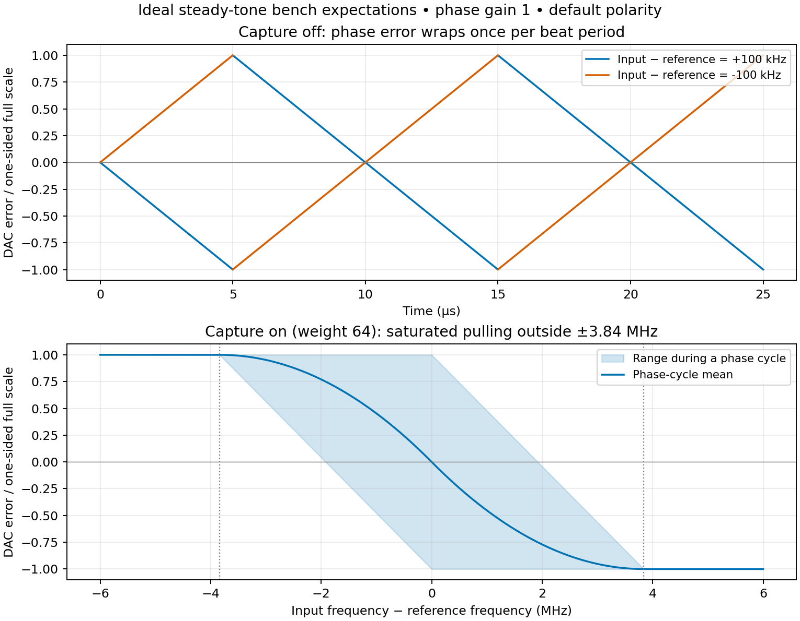

# Laser phase error path

ADC tile 224 block 3 measures a real laser beat near 800 MHz. A fabric reference
NCO, internal quadrature mixer, short image-rejection FIR and CORDIC produce
`reference phase - measured phase`, once per 245.76 MHz clock. DAC tile 229
block 1 sends that error to the external analog controller. There is no digital
PI/PID controller. A separately enabled frequency discriminator assists
acquisition over the intended 700–900 MHz input range.

## Current numerical specifications

These specifications assume the saved RFDC configuration, an 800 MHz reference,
continuous valid samples and no DAC stalls. Numerical granularity is not a
measurement of the physical phase-noise floor.

| Quantity | Current value | Interpretation |
|---|---|---|
| ADC sample rate | 1.96608 GS/s | Eight chronological real samples per fabric clock |
| Error update rate | 245.76 MS/s | One independent error value every 4.069 ns |
| Phase output step | 23.97 microradians, 0.001373 degrees | 18-bit full-turn code |
| Tested arithmetic error | Below 65 microradians | Versus an ideal mixer with the same quantized FIR, for the supplied test tones |
| DAC-equivalent phase step | About 383 microradians at gain 1; 24 microradians at gain 16 | Nominal 14-bit DAC quantization; excludes analog noise |
| Unsaturated phase-only range | Approximately +/-pi / phase gain | Phase gain is `2**phase_gain_shift` |
| Reference tuning step | 6.985 microhertz | 48-bit DDS; absolute frequency accuracy follows the sample clock |
| Frequency-discriminator code step | 937.5 Hz | Adjacent phase samples; no averaging |
| Unambiguous residual frequency | Strictly within +/-122.88 MHz | Sampled phase advance must remain below half a turn |
| Intended acquisition interval | 700–900 MHz input at 800 MHz reference | Correct frequency polarity verified at both +/-100 MHz limits |
| FIR attenuation at 100 MHz residual | 3.72 dB | Reduces acquisition SNR near the edges |
| FIR signal group delay | 7.884 ns | Separate from registered computation latency |
| ADC word to DAC output register | 17 clocks = 69.17 ns | RFDC accepts the word on the following edge |
| Digital delay including FIR and acceptance edge | About 81.13 ns | Excludes ADC packing, converter and analog-path delays |

## Signal path and changes

```text
ADC 224/3, real 1.96608 GS/s, mixer and decimator bypassed
  -> 8 real samples/clock x exp(-j reference phase), 48-bit fabric DDS
  -> identical 32-tap FIRs on I and Q, decimation by 8
  -> one atan2(Q,I) per clock, 18-bit signed binary turns
  -> subtract from programmable phase offset
  -> optional wrapped phase-difference frequency term
  -> gain, polarity and saturation
  -> DAC 229/1, one repeated error value, Q=0, DAC NCO=0
  -> external analog controller -> laser actuator
```

The saved `TransportPhaseLockFF.srcs/sources_1/bd/design_1/design_1.bd` contains
the integration. `scripts/add_laser_pll.tcl` reproduces the migration on the
original design; do not run it again on the already migrated BD. Root
`design_1.tcl` is an older export and is not the current design's build source.

* ADC 224/3 changes from RFDC real-to-complex mixing and 2x decimation to real
  data with 1x decimation and mixer bypass. Its 128-bit stream remains eight
  16-bit words per clock; those words now represent eight real samples.
* `iq_split_1`, `rfdc_iq_derotator_4l_0` and the DAC's
  `AxisConstant14Samples_1` test source are removed. Their former test FIRs have
  TVALID explicitly tied low. The associated old DMA capture chain is idle;
  `iq_dma_capture_debug.py` no longer captures this ADC path.
* `laser_pll_0`, `pll_frequency`, `pll_control` and `pll_status` are added.
  ILA slot 11 now sees the real ADC stream. The existing transport phase
  extractor, subtractor, controller and their converter channels are retained.
* DAC 229/1 retains 6.88128 GS/s, 4x interpolation and C2R packing, avoiding
  changes to the other DACs sharing its clock. Each 224-bit beat contains seven
  identical `{Q=0, I=error}` pairs. This is one independent error sample per
  clock, held across the DAC word. The DAC fine mixer stays at zero frequency
  and zero phase; it is not the reference oscillator.
* New GPIOs run in the RF clock domain. The existing AXI interconnect supplies
  clock conversion from the processor; no asynchronous multibit GPIO bus is
  sampled directly by the detector.

## Modules and pipeline boundaries

The Vivado BD contains `laser_pll_0`, a module reference with an inspectable RTL
hierarchy. Inside it, `laser_pll_wrapper.v` only provides the Verilog interface
required by Vivado 2024.1. `laser_pll.sv` wires the processing modules, qualifies
amplitude/valid signals and assembles diagnostics; it contains no controller.
The following are separate RTL modules, not separate top-level BD cells:

| Instance below `laser_pll_0/detector` | Source | Boundary format and purpose |
|---|---|---|
| `mixer` | `laser_pll_mixer.sv` | 128-bit real input -> eight signed 18-bit I/Q values; two fractional ADC bits |
| `filter_i`, `filter_q` | `laser_pll_fir.sv` | Each takes eight samples and produces one signed 24-bit sample; eight fractional ADC bits |
| `phase_extractor` | `laser_pll_cordic.sv` | Two signed 24-bit inputs -> one signed 18-bit phase in binary turns |
| `error_detector` | `laser_pll_error.sv` | Phase/valid -> wrapped phase and frequency errors, then a saturated 16-bit DAC target |
| `dac_output` | `laser_pll_dac.v` | One 16-bit target -> repeated seven-pair RFDC word, with hold/mute/stall handling |

All stages use the same 245.76 MHz clock. For a word accepted on edge **n**,
with continuous ADC valid and DAC ready:

| Edge | Registered work completed | Useful simulation/probe signals |
|---|---|---|
| n | DDS lane phases and ADC samples captured | `mixer.phase_accumulator`, `mixer.frequency_word` |
| n+1 | Sine/cosine magnitudes read from BRAM | `mixer.lanes[k].sin_magnitude`, `cos_magnitude` |
| n+2 | Quadrant signs applied, ADC samples aligned | `mixer.lanes[k].sine`, `cosine`, `sample2` |
| n+3 | Eight I/Q products | `mixed_i`, `mixed_q`, `mixed_valid` |
| n+4 | 32 FIR tap products on each quadrature | `filter_i.products`, `filter_q.products` |
| n+5 | FIR sums in groups of four | `filter_i.sum2`, `filter_q.sum2` |
| n+6 | FIR sums in groups of sixteen | `filter_i.sum4`, `filter_q.sum4` |
| n+7 | Complete FIR sums; decimated I/Q available | `filtered_i`, `filtered_q`, `filtered_valid` |
| n+8 | CORDIC half-plane rotation | `phase_extractor.x[0]`, `y[0]`, `z[0]` |
| n+9 through n+14 | Six groups of three CORDIC iterations | `phase_extractor.x[1:6]`, `y[1:6]`, `z[1:6]` |
| n+14 | Rounded phase available | `measured_phase`, `phase_valid` |
| n+15 | Phase subtraction and wrapped first difference | `phase_error`, `frequency_error`, `error_valid` |
| n+16 | Gain-weighted error registered; saturated target available | `error_detector.combined_error`, `dac_target`, `target_valid` |
| n+17 | DAC word registered | `m_axis_tdata`, `dac_output.dac_code` |
| n+18 | RFDC can accept that registered word | `m_axis_tvalid && m_axis_tready` |

The FIR additionally represents 15.5 ADC sample periods of signal group delay.
Its valid output waits for three preceding eight-sample history words after
reset or a data gap. Valid follows each corresponding arithmetic pipeline;
the CORDIC does not use the input's undelayed valid. Gain/offset changes are
control events, not input-sample metadata. Mute for a clean offset change;
gain fields can change together in one GPIO write.

## Phase convention and precision

For `x=A cos(theta_signal)` and a reference `theta_ref`, the desired mixer
product after rejecting the sum-frequency image is
`z=(A/2) exp(j(theta_signal-theta_ref))`. Therefore:

```text
p[n] = atan2(Q[n], I[n])
e[n] = wrap_to_minus_pi_plus_pi(phase_offset - p[n])
d[n] = wrap_to_minus_pi_plus_pi(p[n-1] - p[n])
frequency_error_Hz = d[n] * 245.76e6 / (2*pi)
```

Increasing the input frequency above the reference produces a negative
frequency error. `invert` reverses the complete analog error for the actuator's
required feedback polarity. The phase offset specifies the desired relative
phase, including fixed optical/electrical delays.

CORDIC uses 18 vectoring iterations, three per clock, with a coarse half-plane
rotation and 24-bit internal angle arithmetic. Its output is signed 18-bit
binary turns: `-131072=-pi`, `65536=pi/2`, and one code is 23.97 microradians.
Modulo arithmetic implements the exact full-turn wrap. The implementation
uses the CORDIC vectoring method and full-circle rotation described in
[AMD PG105](https://www.amd.com/content/dam/xilinx/support/documents/ip_documentation/cordic/v6_0/pg105-cordic.pdf),
with its own grouped pipeline to reduce latency.

The custom CORDIC was chosen to put exactly three iterations between registers,
giving seven stages including coarse rotation. AMD's IP also supports full-circle
arctangent and one-result-per-clock parallel operation, with selectable
pipelining. Custom RTL is not required for the function. Its intended benefit
is explicit control of register placement; the cost is longer combinational
paths and responsibility for numerical verification. An equivalent vendor-IP
configuration has not been benchmarked here, so a latency/resource advantage
over that configuration has not been established. Keep this module boundary
if substituting the IP, and adapt its phase format and valid latency explicitly.

The DDS uses a 48-bit accumulator, the upper 16 bits for angle lookup, and
18-bit sine/cosine amplitudes. The quarter-wave table samples bin midpoints;
its constant half-bin reference offset can be absorbed into `phase_offset`.
Keep the generated `.mem` file with the sources. The lookup resolution and
ADC noise also affect accuracy; 18 output bits do not imply 18 noise-free
physical phase bits.

Clock noise also matters at the carrier frequency: a relative timing error
`delta_t` gives `delta_phi = 2*pi*800e6*delta_t`. For example, 100 fs corresponds
to 503 microradians at 800 MHz. This is a conversion of units, not an estimate
of the board's jitter; correlations with the optical/RF reference determine
how much clock noise appears in the measured phase.

`atan2` removes the direct dependence on a common I/Q amplitude. It does not
remove additive noise, ADC clipping, residual mixer images, or phase
uncertainty during a deep amplitude fade. A configurable threshold on
`max(abs(I),abs(Q))` suppresses phase output near zero amplitude. The threshold
is in post-mixer ADC counts; a tone's vector amplitude is approximately half
its ADC peak amplitude. This max-norm threshold varies with phase by up to
sqrt(2). Zero input is always invalid. FIR overflow saturates instead of wrapping.

## Reference frequency and future trajectories

```text
FCW = round(f_reference_Hz / 1.96608e9 * 2**48)
lane_phase[k] = accumulator + k*FCW       (k=0..7)
accumulator_next = accumulator + 8*FCW   (modulo 2**48)
```

The tuning resolution is approximately 6.985 microhertz. The tuning relation
is the standard [DDS accumulator relation](https://www.analog.com/en/resources/faqs/faq_dds_tuning_word_desired_output_frequency.html).
The accumulator runs through output-disable periods and ADC-valid gaps, so
its phase follows clock time. A frequency write preserves the current phase;
only an explicitly requested restart clears the accumulator.

Write the low word, then toggle the high-word commit bit. The next RF edge
latches the complete 48-bit word; the next sample block uses the new step.
There is no partial-word frequency excursion. The status acknowledgement
confirms acceptance.

This gives **phase-continuous** tuning. GPIO/Python write times do not establish
phase coherence with an independently changing external tone. For that later
application, replace the staged GPIO words/commit with a clock-synchronous
trajectory source, share its frequency/phase epoch with the reference source,
and account for path delay. Returning to an earlier frequency does not restore
the phase of an independently free-running oscillator; see
[Analog Devices on phase continuity versus coherence](https://www.analog.com/en/resources/faqs/faq_are_frequency_changes_of_a_dds_phase_coherent.html).

## Image rejection and acquisition range

The only digital filter is a 32-tap symmetric Kaiser-window FIR, with a 120 MHz
half-amplitude cutoff at 1.96608 GS/s, applied before decimation. The coefficients
are generated by `scripts/generate_laser_pll_tables.py` using
[SciPy firwin](https://docs.scipy.org/doc/scipy/reference/generated/scipy.signal.firwin.html),
rounded to signed Q1.17 with exactly unity DC gain. Group delay is
`15.5 / 1.96608e9 = 7.884 ns`. Gain at +/-100 MHz is approximately -3.72 dB.

With an 800 MHz reference and input from 700 to 900 MHz, the real-mixer image
folds into 266.08–466.08 MHz. The quantized FIR's worst gain in that interval
is approximately -69.5 dB. That finite rejection leaves some deterministic
phase ripple; it is not an unlimited image or interference filter. For an
otherwise ideal real tone, the image-to-desired amplitude ratio is
`r=abs(H(image_frequency)/H(residual_frequency))`, giving a maximum phase
deviation `asin(r)`. This contribution is about 127 microradians peak at zero
offset and reaches about 468 microradians over the +/-100 MHz interval. At
zero offset its ripple is at 120.32 MHz after decimation, well above the target
loop bandwidth. These are calculated image effects, separate from the
below-65-microradian arithmetic error against the already filtered reference.
They exclude ADC noise and DDS lookup errors. Re-evaluate
these bands before moving the reference far from 800 MHz. A short FIR has a
broad transition band: strong additional input tones can alias into the
detector after decimation, so the input must be dominated by the intended beat.

The phase-difference discriminator is unambiguous for residual frequencies
strictly below 122.88 MHz in magnitude. +/-100 MHz fits with some noise margin;
larger offsets can alias to the wrong frequency sign. The first difference
after an invalid sample is forced to zero, preventing a phase gap from being
treated as a one-clock frequency estimate.

At a +100 MHz input offset, the measured phase advances by 146.484 degrees
per output sample. Taking the wrapped difference recovers that advance even
when the absolute phase crosses +/-pi. The frequency error is consequently
-100 MHz, rather than a phase sawtooth whose average contains little pulling
information. There is 33.516 degrees of phase-increment margin to the alias
boundary at this offset. This detector tracks the local phase slope; it does
not count accumulated turns or determine an offset outside its Nyquist range.

The hardware combines phase and frequency in **phase-code units**:

```text
combined = (phase_error + capture_enable * (frequency_error << capture_gain_shift))
           << phase_gain_shift
DAC_code = saturate_to_signed_16((invert ? -combined : combined) >> 2)
```

The equivalent derivative coefficient in seconds is
`2**capture_gain_shift / 245.76e6`. For the default shift 6 it is 260.4 ns.
The term produces the correct saturated acquisition polarity at +/-100 MHz.
With shift 6, its magnitude exceeds even the largest wrapped phase term for
offsets greater than 1.92 MHz; above 3.84 MHz the combined output is guaranteed
to saturate with the correct polarity at phase gain 1, for ideal steady tones.
As the offset decreases, the phase term becomes significant and provides the
local phase-lock error. Saturation intentionally bounds the voltage sent to
the controller; there is no digital integrator to wind up.
Successful capture still depends on actuator tuning range and the analog
controller's response to that output. Disable it after acquisition to remove
the frequency discriminator's added noise; the hardware does not claim or
automatically detect optical lock.

Leaving acquisition enabled also changes the small-signal detector transfer
function: near lock it is approximately a phase term plus `260.4 ns * d/dt`
at the default capture gain. Turning it off therefore changes loop gain and
phase as well as noise. Tune the locked analog loop for the phase-only mode,
and assess the transition on the actual actuator.

At phase gain zero the nominal slope is `32768/pi` input DAC codes/radian and
the phase-only full scale is +/-pi. The physical DAC has 14-bit resolution in
a 16-bit data path ([AMD RF-DAC features](https://docs.amd.com/r/en-US/pg269-rf-data-converter/RF-DAC-Features)).
Its nominal phase step at gain zero is about 383 microradians. Gain shift 4
makes that about 24 microradians, at the cost of reducing the unsaturated
phase range to approximately +/-pi/16. Voltage/radian must be calibrated for
the DAC output current, board load and analog input. The error output requires
a DC-coupled path; a transformer-coupled RF output cannot carry static error.

## Latency and the 1 MHz loop target

The shortened RTL pipeline takes 17 clocks (69.17 ns) from an accepted ADC
word to the DAC output register, plus the FIR's 7.884 ns signal group delay.
The DAC accepts that register on a subsequent edge. ADC packing, converter
FIFOs, RFDC DAC interpolation/mixing and the physical analog path add delay.
There are no added DMA buffers or clock crossings in the new fabric signal path.

Pure delay contributes `-360*f_Hz*tau_s` degrees. The roughly 77 ns digital
pipeline/filter estimate alone contributes about 27.7 degrees at 1 MHz.
Including the following DAC acceptance edge gives 81.13 ns and 29.2 degrees.
Each additional 245.76 MHz pipeline clock would cost 4.069 ns, or 1.465 degrees
at a 1 MHz unity-gain frequency.
For a frequency-actuated laser with a single frequency-to-phase integrator,
and no other lag/lead, `phase_margin = 90 degrees - 360*f_unity*tau_total`.
45-degree margin at 1 MHz therefore requires at most 125 ns total delay;
60-degree margin allows only 83.3 ns. These are budgeting calculations, not a
closed-loop stability measurement. Include the actual controller/actuator
transfer function and measure converter-to-converter latency before selecting
the final unity-gain frequency or phase-lead compensation.

Under normal operation the RFDC continuously accepts DAC words. If it stalls,
the output holds its AXIS beat stable and sets a sticky diagnostic. Intermediate
errors are discarded rather than queued. Disable, reset, invalid phase or
insufficient amplitude produces zero output when the DAC can accept a word.

## PYNQ use

`scripts/export_laser_pll_overlay.tcl` collects the matching `.bit`, `.hwh`,
Python helper and [Jupyter notebook](../python_scripts/laser_pll_bringup.ipynb)
in `build/laser_pll_overlay/`. Copy those four files into one directory on the
PYNQ board and open the notebook there. Use the existing board-specific clock
initialization at its normal point in the loading workflow; do not change the
sample rates. The notebook has separate cells for setup, acquisition, status,
capture-disable, gain changes, phase-continuous retuning and mute. Run its
operating steps individually rather than using Run All.

The equivalent loading cell is:

```python
from pathlib import Path
import sys
from pynq import Overlay

overlay_dir = Path.cwd()  # directory containing the four exported files
sys.path.insert(0, str(overlay_dir))
import laser_pll

# Use the existing board clock initialization at its normal point in this workflow.
overlay = Overlay(str(overlay_dir / "laser_pll.bit"))
```

Configure the detector and then enable acquisition in separate cells:

```python
import laser_pll

actual_hz = laser_pll.configure(overlay, reference_frequency_hz=800e6,
                              capture_gain_shift=6, minimum_amplitude=64)
# configure leaves the output muted; verify actuator polarity and gain first.
laser_pll.enable_capture(overlay, True)
laser_pll.enable(overlay, True)
print(laser_pll.status(overlay))

# Once lock is established externally:
laser_pll.enable_capture(overlay, False)

# GPIO gain changes: phase gain=4, frequency weight=32 relative to phase.
# This writes both gain fields together and preserves enable/capture/polarity.
laser_pll.set_gains(overlay, phase_gain_shift=2, capture_gain_shift=5)

# An ordinary frequency change preserves the reference accumulator's phase:
laser_pll.set_reference_frequency(overlay, 800.001e6)
laser_pll.enable(overlay, False)  # mute when finished
```

`configure` sets the DAC NCO to zero, resets its accumulated phase, and sets
unity mixer scaling and C2R mode. Do not
run the old test notebook's ADC mixer/decimation configuration afterward.
The helper checks the loaded HWH configuration; runtime sample-clock changes
invalidate its frequency conversion. Reconfigure gain or phase offset while
muted for a clean change; `set_gains` also supports an intentional live gain step.
Gains are power-of-two settings (1 through 32768), not arbitrary fractional
coefficients. RFDC analog calibration and deterministic multichannel synchronization
are separate from the fabric reference's accumulator.

| GPIO and address | Channel 1 at +0x00 | Channel 2 at +0x08 |
|---|---|---|
| `pll_frequency`, 0xA01E0000 | FCW[31:0] | [15:0] FCW[47:32], [16] commit toggle, [17] restart phase on commit |
| `pll_control`, 0xA01F0000 | control bits below | signed phase offset in low 18 bits |
| `pll_status`, 0xA0200000 | phase and status bits below | sign-extended 18-bit frequency-error code |

Control bits: 0 enable, 1 capture term, 2 invert, 3 clear detector/sticky status,
7:4 phase gain shift, 11:8 capture gain shift, 15:12 reserved,
31:16 minimum amplitude. Defaults are zero, so the output starts muted.
Status bits: 17:0 signed phase error, 18 enabled, 19 valid, 20 output saturated,
21 DAC stall seen, 22 frequency commit acknowledgement. Phase/frequency status
reads are live and are not a simultaneous snapshot or a lock indicator.

## Bench testing before connecting the laser controller

The custom DC-coupled DAC interface has already been verified with the former
constant-output setup. This procedure therefore concentrates on the new
detector, using that same interface and no laser controller. The RFSoC device
supports DC-coupled outputs with the appropriate bias/load network; see
[AMD RF-DAC analog outputs](https://docs.amd.com/r/en-US/pg269-rf-data-converter/RF-DAC-Analog-Outputs).
No change to the verified analog interface is proposed here.

Expect a bench-ready digital implementation after the normal board clock
initialization and loading the supplied overlay. Expect to measure voltage
scaling, sign, noise and converter latency before closing a 1 MHz optical loop.
RTL simulation and static timing do not establish the analog loop's stability
or capture time. Board clock initialization is deliberately not guessed by
the notebook, and no on-board test has yet been performed for this new path.

1. **Muted output and input amplitude.** Disconnect the controller, load the
   matching overlay and configure while muted. Measure the DAC interface's
   zero-code voltage, `V_zero`; differential zero error need not be zero volts
   at every node of a biased interface. Drive ADC 224/3 with a generator near
   800 MHz at a level within the verified input range, above the detector
   threshold and below clipping. Use the existing ADC ILA view if amplitude
   needs checking. A common frequency standard for the generator and board,
   where available, reduces relative drift during near-zero-offset tests.
2. **Phase-only sign and wrap.** Fix the generator at 800 MHz. Set reference
   to 799.9 MHz, phase gain shift 0 and capture disabled, then enable output.
   Expect a downward phase ramp followed by an upward wrap, repeating every
   10 microseconds. Set reference to 800.1 MHz: expect the opposite ramp at
   the same period. This simultaneously checks channel mapping, mixer sign,
   phase wrapping, DAC polarity and continuity through the stream.
3. **Amplitude rejection.** At the same nonzero offset, change RF amplitude
   over a useful range without clipping or crossing the threshold. The ramp
   period and calibrated voltage span should stay approximately constant;
   noise will grow as signal amplitude decreases. A phase-modulation test is
   more quantitative than watching an amplitude-insensitive sawtooth. With
   the RF drive removed, `valid` should eventually clear and output should
   mute if the noise stays below the configured threshold.
4. **Acquisition sign and range.** Restore phase gain 1, enable capture with
   shift 6, and step reference below and above the fixed 800 MHz input. The
   output should become negative for reference below input and positive for
   reference above input, relative to the measured zero-code voltage and
   the interface's polarity. Beyond 3.84 MHz offset, ideal steady-tone output
   is fully saturated for this gain. Check references 700 and 900 MHz to
   exercise the two +/-100 MHz limits. GPIO frequency status should be near
   -100 MHz and +100 MHz respectively. ADC/generator clock error and phase
   ripple affect the instantaneous value. This fixed-input reference sweep
   has the same desired/image frequency intervals as the nominal 800 MHz
   reference with a 700–900 MHz input sweep.
5. **Small-signal response and latency.** Match frequencies, disable capture,
   and arrange the static phase/setpoint so that small phase modulation does
   not cross a wrap or saturation boundary. Apply known small phase modulation
   (for example 0.01–0.05 rad) to the generator and measure the DAC error versus
   modulation reference over frequencies spanning the intended loop bandwidth.
   Calibrate volts/radian and measure excess phase lag; a delay appears as
   `-2*pi*f_modulation*tau`. Include the generator's own modulation delay when
   interpreting this measurement. A phase step with a trustworthy timing
   reference can also measure total latency. Measure noise with a sufficiently
   fast acquisition path; slow GPIO polling cannot yield a 1 MHz-band phase
   noise spectrum. Check that `dac_stall_seen` remains false throughout.

For default polarity, define `delta_f = f_input - f_reference`. Ignoring
quantization, ripple and analog filtering, the steady-tone waveform is

```text
phase_error(t) = wrap(phase_offset - phi_initial - 2*pi*delta_f*t)
frequency_increment = -2*pi*delta_f / 245.76e6
u(t) = clip(2**phase_gain_shift
            * (phase_error(t) + capture*2**capture_gain_shift*frequency_increment)
            / pi, -1, +1)
V_error(t) approximately equals V_zero + V_full_scale*u(t)
```

`V_full_scale` is the measured one-sided voltage scale including interface
polarity, not an assumed FPGA voltage. Turning on inversion changes the sign
of `u`. For a changing frequency, replace `delta_f*t` with its time integral.
Ordinary reference steps retain accumulated phase; they change ramp slope
after the processing/filter transient rather than restarting phase at zero.

| Fixed 800 MHz input; reference setting | Capture off, phase gain 1 | Capture on, shift 6 |
|---|---|---|
| 799.9 MHz | Downward sawtooth, 10 microsecond period | Same ramp with a negative bias and some clipping near the rail |
| 800.0 MHz | Phase-dependent DC; slow drift if clocks are not exactly matched | Same DC in the ideal zero-frequency-error case |
| 800.1 MHz | Upward sawtooth, 10 microsecond period | Same ramp with a positive bias and some clipping near the rail |
| 700 MHz | Sampled phase sawtooth at 100 MHz; only 2.46 samples per cycle | Negative full scale |
| 900 MHz | Opposite sampled phase ramp at 100 MHz | Positive full scale |

At exact frequency match, **zero output is not guaranteed**: without feedback,
the generator can have any phase relative to the NCO. Sweeping through the
match slows the sawtooth to DC and reverses its slope. Increasing phase gain
clips more of the open-loop sawtooth; use gain 1 for the first inspection.
At +/-100 MHz, do not expect a smooth ramp on the scope; use the acquisition
rail and frequency diagnostic to check sign/range instead.



This figure is an ideal calculation from `scripts/plot_laser_pll_bench.py`, not
RTL or measured data. The lower curve is a mean over a complete phase cycle
at nonzero offset; the shaded region is the within-cycle output range. At
zero offset the actual output depends on static phase, so the mean curve does
not prescribe its value. The acquisition rails extend through +/-100 MHz
under the stated single-tone assumptions. Oscilloscope bandwidth and the
analog interface round the discontinuities in an actual measurement.

For the initial scope test, with the generator fixed at 800 MHz:

```python
laser_pll.configure(overlay, reference_frequency_hz=799.9e6,
                    phase_gain_shift=0, capture_gain_shift=6,
                    minimum_amplitude=64, invert=False)
laser_pll.enable_capture(overlay, False)
laser_pll.enable(overlay, True)
# Observe the downward 10 us sawtooth, then run the following in a new cell:
```

```python
laser_pll.set_reference_frequency(overlay, 800.1e6)
# Observe the upward 10 us sawtooth.
print(laser_pll.status(overlay))
```

Capture checks should also be separate cells, so each level can be observed:

```python
laser_pll.enable_capture(overlay, True)
laser_pll.set_reference_frequency(overlay, 700e6)
# Expect negative full scale; frequency_error_hz approximately -100e6.
print(laser_pll.status(overlay))
```

```python
laser_pll.set_reference_frequency(overlay, 900e6)
# Expect positive full scale; frequency_error_hz approximately +100e6.
print(laser_pll.status(overlay))
```

```python
laser_pll.enable(overlay, False)
```

## Piezo acquisition and EOM handoff

The operating sequence below is a starting procedure, not a set of measured
controller settings. The piezo/EOM transfer functions, analog filter states
and actuator limits are not represented in the RTL simulations. In particular,
an oscillating frequency error crossing zero does not establish acquisition.
The EOM is **inside the laser cavity**, so it is a fast frequency actuator.
Both analog controllers have integrator limits, and resetting their integrators
requires toggling the controllers off/on; no separate state-tracking or hold
capability has been established.
The piezo controller remains on throughout operation and normal handoff.

There is **one shared analog error output** in this architecture. Enabling
capture adds the frequency term to whatever both analog branches receive.
The FPGA does not independently select a frequency error for the piezo and a
phase-only error for the EOM. Analog output gates/holds and controller state
management are external; the Python enable flag mutes the shared detector
output, not either actuator individually.

| Operating stage | FPGA capture term | Piezo branch | EOM branch |
|---|---|---|---|
| Prepare | Configure, output muted | Establish the initial tuning bias; select compensation and limits before closing | Off/reset; select the intended tracking filters and low initial gain |
| Coarse acquisition | Enabled | Remain on at conservative acquisition gain; monitor excursion and actuator limits | Off, so saturated acquisition error cannot drive it to a rail |
| Settle and approach phase lock | Enabled, reduce frequency weight as settling permits | Keep command continuous and verify bounded frequency/phase motion | Still off |
| Handoff | Enabled at small weight, e.g. shift 0 (weight 1) | Remain on and preserve the tuning command | Engage at low gain only when the whole excursion fits its measured pull-in capability; filters selected for phase-only tracking |
| Confirm phase lock | Disable the remaining small frequency term | Remain on | Verify stability through the change, then raise gain as established by measurement |
| Locked tracking | Disabled | Correct slow drift and, where the analog topology permits, recenter the fast actuator | Supply the faster correction with its intended tracking filters |
| Loss of lock/reacquisition | Re-enable only after turning off the EOM branch | Preserve a useful tuning command where possible; avoid an unnecessary off/on reset | Turn off/reset before exposing the shared error to capture again |

Set the EOM's filters before enabling its output. Switching an integrating
filter into the loop with an unrelated stored state can create a voltage step.
Similarly, preserve the piezo output when changing its compensation: resetting
an integrator to zero may throw away the tuning voltage that brought the laser
near the target. Output tracking or preloading the controller state is the
usual way to make such transfers continuous; see
[MathWorks on bumpless controller transfer](https://www.mathworks.com/help/simulink/slref/bumpless-control-transfer-between-manual-and-pid-control.html).
Those tracking facilities are not assumed to exist in the present controllers.
For this hardware, do **not** toggle the piezo controller off/on during a normal
handoff. Choose its filters beforehand and leave it active. Start the EOM
controller off and turn it on once after the capture term has been reduced
to a small weight. Remove the remaining term after phase acquisition; disabling
it before EOM engagement is also an option if the slow loop holds a sufficiently
stable handoff window. The output transient on the EOM on/off transition must be checked
experimentally; an integrator reset alone cannot guarantee a continuous
actuator command. If changing an analog filter also resets controller state,
do not include that filter change in the normal handoff.
An output clamp alone does not stop an upstream integrator winding up; see
[MathWorks on anti-windup](https://www.mathworks.com/help/simulink/slref/anti-windup-control-using-a-pid-controller.html).

Hold `phase_gain_shift` fixed during handoff. Increasing it from 0 to 4 raises
both branches' detector gain by 16 (24.1 dB), which also changes crossover and
phase margin. Choose the desired locked gain before tuning the analog loops,
or deliberately compensate the analog gain when changing it. Decreasing
`capture_gain_shift` changes only the added frequency weight; steps of one
halve it. Even that should be based on observed settling, not an unattended
timer. The provided notebook does not automate the analog handoff.

**Does capture change the error near zero frequency offset?** For constant
phase and exactly zero frequency error, it adds zero, so the outputs are the
same. A small constant frequency mismatch adds a bias: at weight 64, 1 kHz
corresponds to 1.636 milliradians of additional phase-equivalent error. However,
zero *mean* frequency offset does not remove the response to phase fluctuations.
Near lock, away from wraps and clipping, the transfer ratio is

```text
error_capture / error_phase_only = 1 + G_capture*(1 - exp(-j*2*pi*f/245.76e6))
```

| Phase-fluctuation frequency | Capture weight 64: magnitude / added phase lead |
|---|---|
| 10 kHz | 1.00014 / 0.94 degrees |
| 100 kHz | 1.0135 / 9.29 degrees |
| 1 MHz | 1.9285 (+5.70 dB) / 58.04 degrees |

Thus the default capture setting is almost invisible to slow phase motion,
but substantially changes the intended fast loop even when the average beat
frequency is correct. Turning it off removes that lead and gain at a fixed
frequency; the resulting phase-margin change also depends on the new crossover.
With `capture_gain_shift=0` (weight **1**, not zero), its effect at 1 MHz is only
+0.0057 dB and +1.46 degrees. Reducing to that small weight before fast-loop
engagement makes the proposed sequence—slow acquisition, fast phase lock,
capture off—a much smaller final change. It still requires a stable operating
window and an analog loop designed for the final phase-only response.

For a ringing piezo path, inspect the **excursion over a time window**, not
just one frequency read or the signed mean. Require the entire residual-frequency
envelope to fit inside an experimentally established handoff window for
several slow-loop settling times/oscillation periods, together with valid
signal and adequate actuator headroom. Piezo-only phase lock is helpful but
not mandatory for this intracavity EOM: the slow path may be unable to suppress
the high-frequency noise that the EOM is intended to correct. The necessary
condition is a frequency/phase trajectory within the fast loop's experimentally
established pull-in capability, for long enough to perform the handoff. Use a
wider threshold and a dwell time
for declaring loss of lock than for accepting acquisition, to avoid chatter.
If relying on piezo phase lock before the handoff, also require a bounded
phase trajectory without repeated full-turn wraps. A mean frequency error of
zero can conceal a large symmetric oscillation. Slow, separate GPIO reads
cannot rule out cycle slips between samples; use an appropriate fast capture
or scope measurement for this criterion.

The default capture setting is deliberately aggressive: the shared output
fully saturates beyond approximately +/-3.84 MHz. A piezo integral controller
can consequently spend acquisition ramping at its rail-limited rate and then
overshoot. Alternating rails and a repeating tuning excursion would be
consistent with a saturation-driven limit cycle or windup, but would not prove
that diagnosis. Start by checking sign at low gain, recording error and piezo
command together, reducing integral aggressiveness and enforcing actuator
limits. Keep crossover away from poorly damped mechanical resonances. The
detector behaves differently as it approaches phase lock: the laser's
frequency-to-phase integration enters the local phase-loop transfer function.
Compensation that works for averaged far-offset frequency pulling may therefore
ring near lock. Persistent ringing means the settled handoff criterion has
not yet been met; choosing a lucky zero crossing is not a robust remedy.

For locked operation, allocate slow drift to the piezo and fast fluctuations
to the EOM with suitable bandwidth separation. A common alternative, when
the controller topology supports it, is to let the slow loop act on the fast
actuator's low-frequency command to recenter it; this is the arrangement
described by [Liquid Instruments for its fast/slow laser controllers](https://knowledge.liquidinstruments.com/en_US/lase-lock-box/laser-lock-box-when-and-how-should-i-use-the-slow-pid-controller).
This is an architectural option for the analog controllers, not something
the present single-DAC RTL implements. Two independently integrating branches
need a combined-loop stability check; tuning each in isolation is insufficient.

The intracavity EOM can correct a static residual frequency within its tuning
range. Measure its coefficient `K_EOM_Hz_per_V` and available voltage headroom;
their product sets a necessary static correction limit. Dynamic pull-in may
be smaller because of delay, controller dynamics, saturation and phase wraps.
An external phase modulator's finite phase-ramp duration is not the relevant
limit for this setup. Neither the +/-100 MHz digital discriminator
range nor the proposed 1 MHz fast-loop bandwidth specifies the analog loop's
pull-in range. Numeric filter corners and handoff thresholds require the
actual actuator/controller response.

## Build and verification

`scripts/validate_laser_pll_project.tcl` validates the integrated BD and regenerates
output products. Use the project's normal synthesis/implementation/bitstream
flow afterward. The project still depends on the existing external transport
HLS IP repositories and sine table; those unrelated dependencies are unchanged.
Vivado still reports the existing missing `TransportPhaseLock/auto_export.tcl`
file entry and transport/ILA width and tie-off warnings. These are outside the new
PLL path and have not been repaired here.

```bash
python3 scripts/generate_laser_pll_tables.py
python3 tests/test_laser_pll.py
python3 tests/test_laser_pll_control.py
vivado -mode batch -source scripts/check_laser_pll_timing.tcl
vivado -mode batch -source scripts/validate_laser_pll_project.tcl
vivado -mode batch -source scripts/check_full_project_timing.tcl
vivado -mode batch -source scripts/export_laser_pll_overlay.tcl
```

The xsim tests exercise actual synthesizable RTL against a floating-point
real-input mixer/FIR reference: amplitude scaling and 1 MHz AM, phase quadrants,
phase wraps, +/-100 MHz frequency offsets and saturated acquisition polarity,
zero-input mute, staged frequency writes, phase continuity, restart and AXIS
packing/stalls. For the supplied tones, maximum phase error versus that
reference is below 65 microradians. This is arithmetic accuracy, not measured
laser phase noise. Python tests cover frequency units, register write order,
signed status and preservation of other controls when toggling acquisition.
The notebook's 14 code cells were also executed against mock GPIO/RFDC objects
using the actual exported HWH parameter metadata; they finish with the output
muted. That checks the host API, not physical board operation. The RTL tests
do not simulate the RFDC's analog behavior, an analog controller, piezo/EOM
dynamics, additive clock noise, or closed-loop optical acquisition. They are
behavioral RTL simulations, not post-route gate-level simulations.

The standalone timing harness adds source/sink registers around the block to
check both setup and hold at a 4.069 ns clock. These model synchronous RFDC/GPIO
boundaries and are not extra registers in the actual PLL. The final isolated
run passed with +0.783 ns setup slack and +0.045 ns hold slack. Timing reports are in
`build/laser_pll_timing/`. They check this block in isolation and do not replace
full-project timing closure or an analog loop measurement.

The **full integrated project** subsequently completed synthesis, placement,
physical optimization and routing in Vivado 2024.1 on 2026-10-06, targeting
`xczu49dr-ffvf1760-2-e`. This used the saved BD with the actual RFDC, GPIO,
transport, DMA and debug logic. No extra pipeline stages were needed.

| Routed result | Value |
|---|---|
| Whole-design worst setup slack | +0.184 ns |
| Whole-design worst hold slack | +0.010 ns |
| Setup/hold failing endpoints | 0 / 0 |
| Worst pulse-width slack | +0.534 ns |
| Worst reported setup path through the PLL | +0.415 ns, mixer ROM to DSP input |
| Worst reported hold path into PLL registers | +0.013 ns, FIR summation |
| Unconstrained internal endpoints / registers without clocks | 0 / 0 |
| Routing errors / bus-skew violations | 0 / 0 |

The overall worst setup path is in the existing RFDC-to-`cordic_average_0`
transport path, not the new CORDIC. The prior saved design had +0.176 ns setup
and +0.010 ns hold slack; both runs meet the existing constraints. This is
static timing analysis of the actual routed design, not an on-board latency
or optical-lock measurement. Existing external-port delay omissions and
clock/CDC methodology warnings remain; timing closure means the specified
constraints are met, not that those unrelated interfaces have been newly
characterized. The full DRC report contains warnings/advisories but no errors.

| Routed resources | Total LUTs | Flip-flops | 36 Kb block RAMs | DSP blocks |
|---|---:|---:|---:|---:|
| New PLL, excluding its AXI GPIOs | 2,971 | 1,610 | 72 | 88 |
| Mixer/DDS | 1,075 | 530 | 72 | 24 |
| I FIR | 337 | 258 | 0 | 32 |
| Q FIR | 335 | 258 | 0 | 32 |
| CORDIC | 944 | 441 | 0 | 0 |
| Error/gain block | 278 | 105 | 0 | 0 |
| DAC output block | 1 | 18 | 0 | 0 |

Small glue logic accounts for the remaining LUTs. The complete design occupies
64,593 LUTs (15.19%), 83,344 flip-flops (9.80%), 240.5 block-RAM-tile equivalents
(22.27%) and 356 DSPs (8.33%). LUT and flip-flop counts include only fabric
primitives; registers absorbed into DSP/BRAM primitives are represented by
those resource counts.

Reports are under `build/full_project/`: `timing_summary.rpt`,
`pll_setup_paths.rpt`, `pll_hold_paths.rpt`, `utilization.rpt`,
`clock_interaction.rpt` and `drc.rpt`. The normal implementation-run directory
also contains bus-skew and route-status reports. Bitstream generation completed
successfully from this routed implementation. The matching files and notebook
are in `build/laser_pll_overlay/`. No overlay has been downloaded to a board by
these scripts.

## RTL walkthrough by source line

Line numbers below refer to the source files accompanying this document. Each
row explains one statement or a short connected block; repeated declarations,
comments and closing `end` statements are grouped. Use `nl -ba filename` to
display the same numbering locally.

Two HDL rules are important throughout. A `wire` assignment is combinational;
it does not itself add a clock. In a clocked block, nonblocking assignments
(`<=`) read the old register values and update their destinations together
after the edge. Thus two assignments written next to each other can describe
two different pipeline stages. `for` loops with fixed bounds create parallel
hardware; they do not make the FPGA execute one loop iteration per clock.
All resets inside these modules are sampled on the rising clock edge. The
`timescale` directive on line 1 sets simulation units/precision, not clock rate.

### `laser_pll.sv`: wiring, amplitude qualification and diagnostics

[Source](../TransportPhaseLockFF.srcs/sources_1/new/laser_pll.sv).
This top-level SystemVerilog module joins the processing blocks. It introduces
no arithmetic pipeline registers of its own.

| Source line(s) | What the statement does |
|---|---|
| 2–4 | State the physical signal path and declare the module. |
| 5–7 | Associate both AXIS interfaces with `clk` and declare the active-low reset for Vivado's interface inference. |
| 8–10 | ADC input: eight 16-bit real samples, a valid flag and the detector's ready output. |
| 11–13 | DAC output: seven 32-bit I/Q pairs, a valid flag and RFDC ready input. |
| 14–17 | Two staged frequency words, the packed control word and phase setpoint. These are already synchronous GPIO outputs. |
| 18–20 | Two 32-bit diagnostic outputs; end the port declaration. |
| 21 | Decode control bit 0 as output/detector enable. |
| 22 | Decode control bit 3 as detector/sticky-status clear. |
| 23 | Extract the amplitude threshold in post-mixer ADC-count units. |
| 24–25 | Declare eight-lane I/Q buses, aligned validity and the frequency-commit acknowledgement. |
| 26–32 | Instantiate the mixer/DDS. It gets only the system reset, so disabling the detector leaves the reference phase advancing. |
| 33 | Always accept the ADC stream; this feedback path cannot backpressure physical sampling. |
| 34 | Derive the detector reset: disabled or explicitly cleared means reset FIR history, phase validity and error history. |
| 35–36 | Declare the two signed 24-bit filtered quadratures and their valid flags. |
| 37–38 | Filter and decimate I. |
| 39–40 | Apply exactly the same coefficients and timing to Q, preserving their relative phase. |
| 41 | Take the unsigned magnitude of I. An unsigned result also represents the magnitude of the most-negative signed input. |
| 42 | Take the corresponding unsigned magnitude of Q. |
| 43–46 | Test `max(abs(I),abs(Q))` against the threshold multiplied by 256 to match the FIR's eight fractional bits. Reject the zero vector even when the threshold is zero. |
| 47–48 | Declare the measured relative phase and its delayed valid flag. |
| 49–52 | Run atan2 on filtered Q/I only when both filters are valid and amplitude is sufficient. The phase returned is signal minus reference. |
| 54–56 | Declare phase/frequency errors, the DAC target and aligned validity/saturation/stall diagnostics. |
| 57–61 | Instantiate the phase subtraction and optional frequency-discriminator/gain block. |
| 62–65 | Instantiate the final output register and RFDC packing block. Give it the system reset plus explicit enable/clear, allowing its AXIS hold logic to operate during a mute request. |
| 66–67 | Pack nine zero bits, commit acknowledgement, stall, saturation, validity, enable and the signed 18-bit phase error into channel 1 status. |
| 68 | Sign-extend the frequency-error code to 32 bits for channel 2 status. |
| 69 | End the module. |

### `laser_pll_mixer.sv`: the reference DDS and real-to-complex multiplication

[Source](../TransportPhaseLockFF.srcs/sources_1/new/laser_pll_mixer.sv).
Each lane represents a different ADC sampling time within one fabric clock.
The lane offsets are essential at an 800 MHz carrier; using the same reference
phase for all eight samples would be incorrect.

| Source line(s) | What the statement does |
|---|---|
| 2–4 | Define the sign convention `I+jQ = x*exp(-j*reference_phase)` and chronological lane order. |
| 5–8 | Declare the clock, reset, packed ADC samples and word-valid flag. |
| 9–10 | Receive the staged low 32 bits and high/control word of the DDS tuning value. |
| 11–15 | Return eight 18-bit I values, eight Q values, validity and acknowledgement. |
| 16 | Store reference phase modulo one turn; `2**48` phase counts represent `2*pi` radians. |
| 17 | Store the active increment per **ADC sample**, not per fabric clock. |
| 18 | Store the four-stage validity shift register. |
| 19 | Detect a new transaction when the requested toggle differs from the last accepted toggle. |
| 20–27 | On system reset clear the phase, active increment, acknowledgement and valid history. |
| 29 | Advance phase by eight sample increments every RF fabric clock, including muted or invalid-input periods. Overflow naturally wraps at one turn. |
| 30–31 | On a commit, concatenate the staged words and latch all 48 frequency bits together. |
| 32 | Acknowledge that commit by copying its toggle. |
| 33 | If explicitly requested, restart phase at zero. This later assignment overrides line 29 on that edge. |
| 35–38 | Advance validity alongside the four registered mixer stages. |
| 39 | Expose the final valid bit. |
| 41 | Generate eight simultaneous sample-processing lanes. |
| 42 | Store the upper 16 reference-phase bits for this lane's table lookup. |
| 43 | Add a quarter turn (`0x4000`) so the same sine table can produce cosine. |
| 44 | Mirror the sine address in quadrants 2 and 4 using phase bit 14. |
| 45 | Apply the same address reflection to the quarter-turn-shifted cosine phase. |
| 46 | Calculate this sample's full-resolution phase as word-start phase plus `lane*FCW`. |
| 47–48 | Declare the quarter-wave BRAM ROM and initialize it from the generated midpoint-sampled table. This is FPGA initialization, not a runtime file read. |
| 49–50 | Declare registered table magnitudes and their matching signs. |
| 51 | Declare signed reference sine/cosine values, scaled approximately by `2**17`. |
| 52 | Declare three ADC delay registers to match the reference lookup stages. |
| 53 | Reserve the full signed 16-by-18-bit multiplier result widths. |
| 54–55 | On an edge capture this lane's lookup angle. On a frequency-commit edge, this still uses the old active word; the new word is used on the next edge. |
| 56 | Capture the corresponding 16-bit ADC lane, with lane 0 in the least-significant bits. |
| 57 | Synchronously read the sine magnitude using the previously registered angle. |
| 58 | Read cosine magnitude through the table's other address. |
| 59–60 | Delay each sign bit with its magnitude read. |
| 61 | Delay the ADC sample through the ROM-read stage. |
| 62 | Apply the registered sine quadrant sign. |
| 63 | Apply the registered cosine quadrant sign. |
| 64 | Delay the ADC sample through the sign stage. |
| 65 | Register `I = sample*cos(reference phase)`. |
| 66 | Register `Q = -sample*sin(reference phase)`, establishing the downconversion sign. |
| 68–70 | Discard 15 fractional product bits and retain signed 18-bit I/Q. Since the oscillator scale was `2**17`, two fractional bits remain relative to ADC counts. |
| 71–72 | End the replicated lanes and module. |

The sample/lookup/product registers deliberately keep running during reset;
the cleared valid pipeline prevents their transient values from being used.
An ordinary commit changes phase slope while preserving accumulated phase.

### `laser_pll_fir.sv`: image rejection before decimation

[Source](../TransportPhaseLockFF.srcs/sources_1/new/laser_pll_fir.sv).
One instance handles I and another Q. Every fabric word evaluates the FIR at
its newest sample, using that word's eight samples plus the preceding 24.
This computes only the FIR outputs needed after decimation, while still
including every input sample in the convolution.

| Source line(s) | What the statement does |
|---|---|
| 2–4 | Specify 32 taps and filtering of quadratures before downsampling. |
| 5–11 | Declare the clock/reset, eight packed signed 18-bit samples, validity and one signed 24-bit filtered result. |
| 12 | Include the generated function mapping tap index to a signed Q1.17 coefficient. |
| 13 | Store the preceding 24 samples, newest first. |
| 14 | Declare the complete 32-sample convolution window, also newest first. |
| 15 | Register all 32 signed 18-by-18-bit tap products in parallel. |
| 16 | Combinationally sum pairs of products; add a bit for sum growth. |
| 17 | Register sums of four products, with another guard bit. |
| 18 | Declare combinational sums of eight products. |
| 19 | Register two sums, each containing 16 products. |
| 20 | Register the final 32-product sum in 41 bits. |
| 21–22 | Track four arithmetic stages of validity and how many preceding eight-sample words are available. |
| 23–24 | For taps 0–7, reverse the current input lanes so tap 0 multiplies the newest sample. |
| 25 | For taps 8–31, use the stored preceding samples. |
| 26–28 | Capture one coefficient multiplication per tap on each edge. |
| 29–30 | Form the 16 pairwise sums from the registered products. These are wires, so there is no separate register here. |
| 31–32 | Form four sums of eight from the registered sums of four; again these are combinational. |
| 33–36 | Clear history and its fill count after reset or an invalid word. A gap cannot be treated as consecutive physical samples. |
| 38 | Move the current word into the newest eight history positions. |
| 39 | Shift the older history back by eight samples using the previous register values. |
| 40 | Increment the count until three preceding words are available, then hold at three. |
| 42 | Clear all output-valid history on reset. |
| 43 | Inject validity only when the current word is valid and all 24 preceding samples were present. Older valid products already in the pipeline may still emerge after a data gap. |
| 44–45 | Register the sums of four, incorporating the combinational pair sums. |
| 46–47 | Register the sums of 16, incorporating the combinational sums of eight. |
| 48–49 | Register the final sum. Together with products, sums of four and sums of 16, this gives four arithmetic stages. |
| 50–51 | Arithmetic-right-shift by 11. Inputs carry two fractional bits and coefficients 17, so the result retains `2+17-11=8` fractional ADC-count bits. |
| 52–53 | Clamp to signed 24-bit limits before narrowing. Overflow then becomes clipping rather than a sign-changing wrap. |
| 54 | Present the valid bit aligned with the final sum. |
| 55 | End the module. |

### `laser_pll_cordic.sv`: full-circle arctangent

[Source](../TransportPhaseLockFF.srcs/sources_1/new/laser_pll_cordic.sv).
Vectoring rotates `(I,Q)` toward the positive x axis while accumulating the
rotation angle. Common amplitude multiplies both coordinates and therefore
does not change the ideal result. The vector grows by the usual CORDIC scale
factor, but no amplitude output is needed, so no scale-compensation multiplier
is included.

| Source line(s) | What the statement does |
|---|---|
| 2–4 | Declare full-circle atan2 with three iterations between pipeline registers and an 18-bit binary-turn output. |
| 5–12 | Declare clock/reset, signed 24-bit quadratures, input validity, phase and output validity. |
| 13–14 | Define a constant lookup function for each elementary rotation angle. |
| 15 | Supply iterations 0–2: rounded `atan(2**(-k))*2**24/(2*pi)`. For `k=0`, a 45-degree step is exactly `2097152`. |
| 16–20 | Supply the progressively smaller angle increments for iterations 3–17 in the same 24-bit turn units. |
| 21–23 | Return zero for any unused index and close the function. |
| 24–25 | Allocate seven sets of signed x/y registers: one coarse-rotation stage and six grouped iteration stages. Their two extra bits accommodate negation and CORDIC vector growth. |
| 26 | Allocate matching 24-bit accumulated-angle registers; a complete turn is `2**24`. |
| 27 | Allocate seven stages of validity. |
| 28 | Sign-extend I to 26 bits before any negation. |
| 29 | Sign-extend Q in the same way. |
| 30–32 | If I is negative, negate I to move the vector into the right half-plane; otherwise keep it. Register the result. |
| 33 | Apply the same possible negation to Q: this is a 180-degree rotation, not a reflection. |
| 34 | Start the accumulated phase at half a turn for that rotation, or zero otherwise. `0x800000` represents -pi, equivalent to +pi modulo one turn. |
| 35–37 | Clear validity on reset or shift the input-valid flag through the seven stages. Arithmetic registers may run continuously; validity determines whether their contents are meaningful. |
| 38 | Instantiate six parallel pipeline groups. Every group processes a different sample simultaneously once filled. |
| 39 | Set this group's first iteration index to `3*s`. These are compile-time constants, so the shifts are fixed wiring rather than general barrel shifters. |
| 40 | First iteration: add or subtract `y*2**(-K)` from x according to the sign of y. |
| 41 | Update y in the opposite rotation sense using the old x, moving y toward zero. |
| 42 | Add the elementary angle when y was nonnegative; subtract it when y was negative. |
| 43 | Second iteration: update x from the first iteration's combinational result, using shift `K+1`. |
| 44 | Update y using the same second-iteration direction. |
| 45 | Accumulate the second elementary angle. |
| 46–47 | Third iteration: update x with shift `K+2` and register the result for the next group. |
| 48 | Register that third iteration's y result. |
| 49 | Register its accumulated angle. Thus three rotations share one register boundary. |
| 50–51 | Close the registered group and replicated stages. |
| 52 | Add half an output LSB in the 24-bit representation before dropping six bits. This implements nearest rounding, with halfway cases toward increasing phase modulo a turn. |
| 53 | Select the upper 18 bits; assigning them to a signed output expresses phase in `[-pi,pi)`. A carry across +pi wraps correctly to -pi. |
| 54 | Output the valid flag aligned with the final angle. |
| 55 | End the module. |

For example, positive I and zero Q should give phase near zero; positive Q
and zero I should give +pi/2. These are quadrature/sign sanity checks, separate
from the later subtraction that makes the final error reference minus signal.

### `laser_pll_error.sv`: phase subtraction, acquisition and gains

[Source](../TransportPhaseLockFF.srcs/sources_1/new/laser_pll_error.sv).
All arithmetic initially uses phase codes. `frequency_error` is a **phase
increment per output sample**, despite its name; multiply it by 937.5 to obtain
Hz. This block contains no integrator or analog-actuator model.

| Source line(s) | What the statement does |
|---|---|
| 2–4 | Define the block and the signed 18-bit full-turn convention. |
| 5–10 | Receive clock/reset, measured relative phase/validity, control bits and phase offset. |
| 11–17 | Return registered phase/frequency errors and their validity, plus the later DAC target, its validity and saturation indication. |
| 18 | Subtract measured phase from the low 18 bits of the setpoint. Keeping 18 bits implements wrapping at exactly one turn. |
| 19 | Retain the previous valid measured phase. |
| 20 | Subtract current phase from previous phase in the same modulo arithmetic. A rising measured phase gives negative frequency error. |
| 21 | Remember whether the immediately preceding clock had a valid phase. |
| 22 | Allocate a 49-bit signed register for the gain-weighted sum. |
| 23 | Sign-extend phase error before adding or shifting, preserving negative values. |
| 24 | Sign-extend the frequency-error increment in the same way. |
| 25–26 | Add `2**capture_gain_shift * frequency_error` only when capture is enabled. Otherwise add zero. |
| 27 | Optionally invert the registered combined error, then arithmetic-right-shift by two to convert phase codes to the 16-bit DAC scale. This is combinational after the combined-error register. |
| 29–32 | State the discriminator's alias limit and enter the synchronous reset handling. |
| 33–34 | Clear previous phase and its validity, ensuring the first valid sample cannot generate a spurious frequency jump. |
| 35–39 | Clear phase/frequency errors, their validity, the weighted sum and target validity. |
| 41 | Remember this clock's phase validity for the next frequency difference. |
| 42 | Align error validity with the phase/error registers written on this edge. |
| 43–44 | Only a valid sample replaces the saved measured phase. |
| 45 | Register the wrapped setpoint-minus-phase error. |
| 46 | Register the wrapped phase difference only when both adjacent samples were valid; otherwise use zero for this first difference. |
| 47 | End the valid-sample update block. Error values hold when invalid, while their valid flag is cleared. |
| 48 | Register the previous cycle's phase/frequency sum after multiplying by `2**phase_gain_shift`. This scales both terms together. |
| 49 | Delay error validity one more clock to match the weighted target. |
| 50–52 | Close the clocked block; the 49-bit width keeps both maximum shift settings from overflowing and reversing the error sign. |
| 53 | Flag any target outside signed 16-bit range. Interpret this flag only with `target_valid`. |
| 54–55 | Clamp positive overflow to +32767 and negative overflow to -32768; otherwise retain the low 16 bits. |
| 56 | End the module. |

The capture and gain fields are consumed when calculating the weighted sum;
polarity is consumed after that register. Controls are not stored alongside
each ADC sample. The Python gain helper writes the two gain fields together,
while offset/polarity changes should be made muted when a clean transition is
required.

### `laser_pll_dac.v`: output register and RFDC word packing

[Source](../TransportPhaseLockFF.srcs/sources_1/new/laser_pll_dac.v).
This is Verilog rather than SystemVerilog, but is included to document the
last signal-processing register and the one-sample-per-clock output behavior.

| Source line(s) | What the statement does |
|---|---|
| 2–4 | State the repeated-sample packing and the required zero-frequency, zero-phase C2R DAC configuration. |
| 5–11 | Receive clock/reset, output enable/clear, signed target, target validity and target saturation. |
| 12–17 | Declare the RFDC stream and output diagnostics. |
| 18 | Store one signed 16-bit error code. This is the final fabric output register. |
| 19–22 | Clear the saturation and sticky stall indicators on reset, disable or clear. |
| 24 | Latch a stall indication when an enabled DAC is not ready; it remains set until explicitly cleared or disabled. |
| 25 | When the DAC accepts a beat, update saturation status to describe the newly registered valid target. |
| 27–29 | Reset the DAC code to zero. Outside reset, preserve an unaccepted AXIS beat as required by the interface. |
| 30–31 | When ready, register the target if enabled and valid; otherwise register zero. If not ready, hold the old output code. Intermediate targets are discarded, not queued. |
| 32–34 | End the clocked logic and generate seven identical output pairs. |
| 35 | Put the error in each pair's low 16-bit I field and zero in its high Q field. This repeats one value, rather than creating seven independent controller updates. |
| 36 | End the packing loop. |
| 37 | Present a continuous valid stream outside reset, including valid zero words during mute or invalid phase. |
| 38 | End the module. |

On edge n+17 the register changes. The RFDC samples its previously presented
value on that edge, so the new value can be accepted on n+18. A mute request
cannot replace a stalled valid beat until the RFDC resumes accepting words.

### `laser_pll_wrapper.v`: Vivado block-design interface

[Source](../TransportPhaseLockFF.srcs/sources_1/new/laser_pll_wrapper.v).
This adapter has no state, arithmetic or extra latency.

| Source line(s) | What the statement does |
|---|---|
| 2–3 | Provide the Verilog top-level module used by the Vivado 2024.1 module reference. |
| 4–6 | Declare the shared AXIS clock and active-low reset metadata. |
| 7–9 | Expose the ADC stream with its ready/valid handshake. |
| 10–12 | Expose the DAC stream with its handshake. |
| 13–16 | Expose the frequency and detector-control GPIO buses. |
| 17–19 | Expose the two status words and close the interface declaration. |
| 20–21 | Instantiate `laser_pll` as `detector`; connect clock, reset and ADC data. |
| 22 | Connect ADC valid and ready directly. |
| 23–24 | Connect the DAC handshake/data and low frequency word directly. |
| 25 | Connect the high frequency/commit word, packed controls and phase setpoint. |
| 26 | Return both diagnostic words without registering them again. |
| 27–28 | Close the instance and module. |
