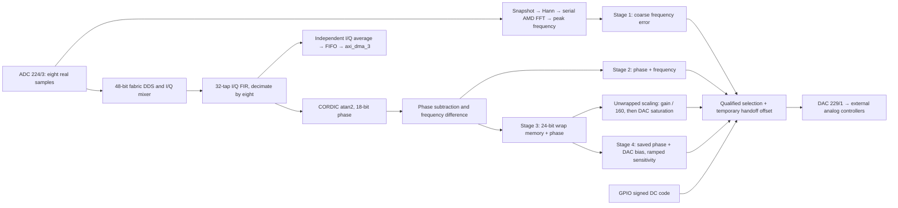

# Laser phase-error output: ADC 224/3 → DAC 229/1

The FPGA measures a real RF beat, compares it with a phase-continuous fabric DDS,
and sends one error sample per 245.76 MHz clock to the external analog controllers.
The piezo and intracavity EOM controllers close the loop. There is no FPGA PI/PID.
The reference remains fixed during acquisition unless explicitly retuned by PYNQ.

This revision provides three manually selected acquisition stages, a **signed 24-bit
phase-wrap counter**, reversed default output polarity, and a literal DC test
output. The coarse stage uses one AMD xFFT radix-2-lite burst core on occasional
raw-ADC snapshots. It is outside the fast phase pipeline. A fourth stage raises
tracking sensitivity after acquisition, and an independent I/Q DMA monitor
preserves amplitude information for noise analysis.

**Tracking/IQ update (October 8, 2026, signature `0xA5`):** the bench test achieved
phase lock with the /160 mapping, even at high controller gain. That working
stage 3 is unchanged. Stage 4 saves its phase/DAC operating point and slews toward
1–256 times its nominal sensitivity. Stage 4 adds three clocks relative to stage
3; stages 0–3 keep their latency. `axi_dma_3` is restored for post-DDC I/Q snapshots.
Deploy the matching A5 bitstream, HWH and helper; the new helper rejects A3/A4.

**Wide-phase mapping update (October 7, 2026, signature `0xA4`):** stage 3 now
maps approximately **±80 turns to the DAC rails at phase gain shift 0**, reducing
its previous slope by 160. The existing phase gain doubles that slope per shift.
This changes stage 3 only; stages 0/1/2 retain their scaling. Stage-3 entry remains
manual, with valid fine data and five clocks of wrap/scaler preparation, without
frequency/FFT/dwell gates. Stage 3 adds two pipeline clocks (8.138 ns).
Rebuild the bitstream and deploy the matching `.bit`, `.hwh`, and Python helper;
the helper rejects the earlier `0xA3` mapping before configuration writes.

If Jupyter reports a version mismatch after replacing the helper, inspect the
**imported module**, not just the file in the editor. An already imported module
retains its old functions until reloaded. With the current `ol` already loaded:

```python
import importlib
import laser_pll
importlib.invalidate_caches()
laser_pll = importlib.reload(laser_pll)
print("Helper:", laser_pll.__file__)
print("Stage-3 divisor:", laser_pll.STAGE3_PHASE_DIVISOR)  # 160
print("FPGA version:", hex(ol.pll_acquisition_status.read(0x08) >> 24))  # 0xa5
```

This does not write GPIOs or reprogram the FPGA. Retry calls through
`laser_pll.function_name(...)`; repeat any `from laser_pll import ...` imports
to replace their old function references. A missing constant with an updated
file indicates stale imported code; do not bypass the version check. Divisor 160
alone does not distinguish A4/A5: the current helper also has `FPGA_VERSION=0xA5`.

## Specifications

These numbers assume continuous ADC valid, DAC ready, and the saved RFDC rates.
Numerical resolution is not the physical phase-noise floor.

| Quantity | Value / interpretation |
|---|---|
| ADC | 224/3, real 1.96608 GS/s, eight chronological signed 16-bit words/clock; physical 14-bit data left aligned |
| Error clock | 245.76 MHz; 4.069010 ns/clock |
| DAC | 229/1, 6.88128 GS/s, interpolation 4, seven repeated `(I=error,Q=0)` pairs/clock |
| Default polarity | **Inverted**, opposite to the previous helper default; verify the complete analog feedback sign |
| Reference DDS | 48-bit accumulator; 6.985 µHz tuning granularity; 16-bit lookup angle, 18-bit sin/cos |
| Phase code | 18-bit full turn: 23.969 µrad/code = 0.001373°/code |
| Tested arithmetic phase error | <65 µrad versus the same quantized FIR and an ideal complex mixer, for supplied tone tests |
| Nominal physical DAC phase step | At shift 0: 383.5 µrad in stages 0/2, 61.36 mrad (3.516°) in stage 3; divided by `2**phase_gain_shift`, assuming a 14-bit DAC |
| Linear phase range | Stage 0: ±½ turn / phase gain; stage 3: approximately ±80 turns / phase gain. Stage 2 can also rail from its derivative term. |
| Stage-3 slope at nominal 2 Vpp | 1.989 mV/rad at shift 0, doubled per phase gain shift; reciprocal approximation error +3.815 ppm |
| Stage-4 sensitivity | `2**tracking_shift` times nominal stage 3; shifts 0..8, smooth intermediate coefficients; saved phase and DAC bias |
| Stage-4 nominal DAC phase step | 3.515625° / `2**tracking_shift`; 0.013733° at shift 8, assuming a 14-bit converter |
| Fine frequency-code step | 937.5 Hz; obtained from adjacent phase samples, without averaging |
| Fine discriminator ambiguity limit | Strictly less than ±122.88 MHz; tested acquisition band ±100 MHz at an 800 MHz reference |
| Coarse RF search | FFT bins 104–495: 199.68–950.40 MHz, covering the requested 200–900 MHz |
| FFT | 1024 points, 16-bit real input, Hann window, 1.92 MHz bins; nearest-bin estimate, no interpolation |
| Raw snapshot duration | 0.520833 µs |
| Measured FFT update interval in RTL | **14,508 clocks = 59.0332 µs** (about 16.94 kHz); not the fast-loop sample rate |
| Phase-wrap memory | Signed 24-bit turns: −8,388,608…+8,388,607; saturates at endpoints, never wraps numerically |
| Extra scaling latency | A4 stage 3 added **2 clocks = 8.138 ns**; A5 stage 4 adds **3 more clocks = 12.207 ns**. A5 leaves stages 0–3 unchanged. |
| ADC word → DAC output register | Stages 0/2: **18 clocks = 73.242 ns**; stage 3: **20 clocks = 81.380 ns**; stage 4: **23 clocks = 93.587 ns** |
| FIR group delay | 15.5 ADC samples = 7.884 ns |
| Digital delay including FIR and next DAC acceptance edge | Stages 0/2: **85.195 ns**; stage 3: **93.333 ns**; stage 4: **105.540 ns**. ADC packing, RFDC converter/interpolator and analog delays are additional. |

The raw RF range is a first-Nyquist-zone requirement. Frequencies above 983.04 MHz
alias into this band and cannot be distinguished by this real-sampled FFT. An RF
preselector is necessary if a strong unwanted Nyquist image is possible. The
coarse estimator selects a dominant tone; it does not identify which laser or
sideband produced it. The fine mixer/FIR image-rejection specification is for a
reference near 800 MHz; an arbitrary low-frequency reference needs a new image
analysis even though the DDS can program it.

## Signal path and module boundaries



| Module | Physical function |
|---|---|
| `laser_pll_mixer.sv` | Free-running coherent DDS; eight parallel real-to-complex multiplications |
| `laser_pll_fir.sv` ×2 | Identical 32-tap image filters on I/Q before decimation |
| `laser_pll_cordic.sv` | Full-circle atan2; six groups of three vectoring iterations plus coarse rotation |
| `laser_pll_error.sv` | Wrapped phase and first difference; parallel legacy, capture and unwrapped DAC targets |
| `laser_pll_unwrap.sv` | Count signed branch-cut crossings, preserving the desired phase modulo one turn |
| `laser_pll_fft.sv` | Capture 1024 raw samples, serialize/window them, run vendor FFT, qualify strongest in-band bin |
| `laser_pll_acquisition.sv` | Coarse error scaling, stage-entry qualification, detector/DC selection |
| `laser_pll_phase_scale.sv` | Three-register stage-3 reciprocal scaling, gain/polarity alignment, rounding and saturation |
| `laser_pll_tracking.sv` | Six-register phase-deviation scaling about a saved phase/DAC bias; gradual coefficient changes |
| `laser_pll_monitor.sv` | Independent signed I/Q means, finite packet/TLAST, explicit loss/invalid flags; never stalls the loop |
| `laser_pll_handoff.sv` | One registered output and a temporary decaying offset for continuous stage changes |
| `laser_pll_dac.v` | RFDC packing, mute, backpressure hold and stall diagnostic |
| `laser_pll.sv`, `laser_pll_wrapper.v` | Wiring, amplitude gate, GPIO status, block-design boundary |

A source-line walkthrough is in [laser_pll_rtl_walkthrough.md](laser_pll_rtl_walkthrough.md).
All these blocks and their GPIOs use the RF fabric clock. The AXI interconnect
crosses from the PS clock domain; no asynchronous GPIO bus enters the detector.

## Phase and frequency signs

For `x=A*cos(theta_signal)`, mixing by `exp(-j*theta_reference)` gives approximately
`I+jQ=(A/2)*exp(j*(theta_signal-theta_reference))` after image rejection.
Let `P=262144` phase codes/turn and `Fe=245.76e6` error samples/s:

```text
p[n] = atan2(Q,I), expressed as signed 18-bit binary turns
e[n] = wrap(phase_offset - p[n])
d[n] = wrap(p[n-1] - p[n])
frequency_error_Hz = d[n] * Fe/P = d[n] * 937.5 Hz
```

The internal frequency error is `f_reference - f_input`. It remains this sign in
status registers, irrespective of the analog polarity bit. With the new default
`invert=True`, an input above the reference produces a positive frequency-driven
DAC output. Analog interface inversion can reverse the voltage on the scope.
A phase offset changes the target relative phase; it does not shift the reference
frequency. Mute before changing phase offset, polarity or restarting DDS phase.

CORDIC suppresses direct common I/Q amplitude dependence. It cannot remove
additive noise, clipping, clock jitter or mixer images. At 800 MHz, 100 fs of
relative timing uncertainty corresponds to 503 µrad. The fine amplitude gate is
`max(abs(I),abs(Q)) >= minimum_amplitude`, in post-mixer ADC counts, approximately
half the raw tone peak near zero detuning. Its threshold depends on phase by up
to √2. Zero I/Q is always invalid. Data gaps reset FIR history and phase history.

The custom CORDIC is unchanged: three iterations between registers, seven stages
total, 26-bit vector arithmetic and a 24-bit internal angle. AMD CORDIC can also
perform atan2; no equivalent vendor configuration has been benchmarked here, so
this does not establish an advantage over it. The explicit grouping preserves the
previous measured pipeline. See [AMD PG105](https://www.amd.com/content/dam/xilinx/support/documents/ip_documentation/cordic/v6_0/pg105-cordic.pdf).

## Three stages

### 1 — Coarse FFT capture

A 128-word memory records eight real samples on each of 128 consecutive clocks.
The capture never stalls the ADC. One sample at a time is read, multiplied by a
Q0.15 periodic Hann coefficient, and sent to a single radix-2-lite burst FFT.
The input uses a three-state read/multiply/send sequence and honors FFT ready.
The FFT runs in non-realtime mode, where these intentional input gaps are legal.

The core uses 16-bit fixed-point data and twiddles, convergent rounding, and
bit-reversed output with `XK_INDEX`. There is no output reordering buffer.
The forward-transform configuration is `24'h0aaaad`: direction in bit 0,
20-bit scaling schedule `0x55556` in bits 20:1. This divides by 4 at the first
stage and by 2 at each remaining stage, total 2048. A bin-centered real tone
with raw ADC peak `A` therefore gives an FFT magnitude near `A/8` after Hann.
A half-bin tone has additional window scalloping loss.

The wrapper compares `Re²+Im²` across bins 104–495. A valid result requires:

- Magnitude at least `minimum_fft_peak` (default 32, approximately raw peak 256 on-bin).
- The strongest bin contains at least 1/8 of the total power in that search band.
- No ADC gap or FFT overflow/frame fault during that transform.

The prominence check rejects broadband noise; it does not prove unique-tone
identity. Estimates are held between transforms. ADC `valid=0` immediately
invalidates the estimate; a 20-bit age watchdog also invalidates an estimate
if updates stop for about 4.27 ms. Analog signal disappearance is recognized by
the next completed snapshot, rather than instantaneously. A stopped core is a
fault requiring reset, not an automatic retry loop.

```text
f_fft = peak_bin * 1.92 MHz
D_fft = floor(FCW / 2**27) - peak_bin*2048     # widened signed frequency codes
DAC = sat16(polarity * (D_fft << coarse_gain_shift) >> 2)
```

At coarse gain 1, a detuning of approximately 122.88 MHz reaches a DAC rail;
larger offsets retain the correct direction out to the RF search boundaries.
The coarse gain is independent of phase gain. Quantization is roughly ±0.96 MHz
for an isolated tone, so this stage is for getting into the DDC range, not phase
locking. The FFT costs **no fast-loop latency**. Its approximately 59 µs update
period does limit the useful bandwidth of the coarse acquisition loop: do not
engage the MHz EOM loop on this sampled/held coarse error.

This choice follows the resource/throughput tradeoff described in
[AMD PG109, radix-2-lite architecture and scaled arithmetic](https://www.amd.com/content/dam/xilinx/support/documents/ip_documentation/xfft/v9_1/pg109-xfft.pdf).
The IP configuration is reproducible with `scripts/create_laser_pll_fft.tcl`.

### FFT resource cost after routing

The integrated October 7, 2026 build targets `xczu49dr-ffvf1760-2-e`.
Percentages below are of the **whole FPGA**, not its remaining free resources.
The complete coarse estimator includes the core, raw snapshot RAM, Hann window,
magnitude/threshold logic and frame controller; it excludes GPIOs and selection.

| Resource | FFT core after routing | Complete coarse estimator | Device capacity |
|---|---:|---:|---:|
| LUTs, including shift-register memory | 536 (**0.126%**) | 803 (**0.189%**) | 425,280 |
| Flip-flops | 1,054 (**0.124%**) | 1,257 (**0.148%**) | 850,560 |
| 36-kbit RAM-tile equivalents | 1.5 (**0.139%**) | 4 (**0.370%**) | 1,080 |
| DSP48E2 blocks | 2 (**0.0468%**) | 6 (**0.140%**) | 4,272 |

The core physically uses three RAMB18 blocks. The complete estimator uses two
RAMB36 plus four RAMB18 blocks. Standalone synthesis reported 662 LUTs and 1,179
flip-flops for the core; integration optimized unused/constant logic to the
smaller routed counts above. There is no meaningful single combined percentage
because LUTs, RAM and DSPs are different resources.

Report: `build/full_project/utilization.rpt`, rows `coarse_estimator` and `fft_core`.

### 2 — Existing phase + frequency capture

```text
DAC = sat16(polarity * ((e + (d << capture_gain_shift)) << phase_gain_shift) >> 2)
```

Stage 2 forces the derivative term on; the legacy capture-enable bit does not
control it. Default frequency weight is 64, adjustable in powers of two down to
1. The FIR passes a ±100 MHz residual with about 3.72 dB attenuation at the edges.
Outside ±122.88 MHz, the sampled phase derivative aliases and can have the wrong
sign. The raw FFT is therefore required for wide capture and stage-2 entry qualification.

A stage-2 request waits for a valid FFT with detuning strictly inside about
±80 MHz and a valid fine target. The margin protects the entry from the DDC
ambiguity boundary. This is an entry guard, not a guarantee of closed-loop
stability, and not an automatic fallback after loss of lock.

Once stage 2 is active, FFT validity does not gate its output; only the fine
phase-valid gate does. If FFT SNR prevents entry, legacy mode 0 with capture
enabled provides the original FFT-independent detector. Use it only when an
independent measurement places the beat inside the tested ±100 MHz fine band.
This deliberately restarts acquisition while retaining reference and gains:

```python
laser_pll.enable(ol, False)
laser_pll.configure_acquisition(ol, stage=0)
laser_pll.enable_capture(ol, True)
laser_pll.enable(ol)
```

The new polarity setting and extra pipeline clock still apply. Lowering
`minimum_fft_peak` while muted can help an amplitude-threshold failure, but does
not relax the separate strongest-bin/total-band-power dominance requirement.

Legacy mode 0 can hand off directly to stage 3 with `select_stage(ol, 3)`;
leave its capture flag enabled and do not call `configure()` between modes.
The same offset fade applies. Stage 3 has no FFT or frequency-band requirement,
so this also works when coarse FFT validity is missing. Valid fine-phase data
and five clocks of wrap/scaler preparation are still required.

The derivative's small-signal multiplier is
`1 + G_capture*(1-exp(-j*2*pi*f/Fe))`. It adds noise and changes loop gain/phase.
Stage 3 removes this term through the handoff mechanism. Stage 0 retains the
previous wrapped detector with its optional capture bit for direct comparison.

### 3 — Unwrapped phase acquisition/tracking

The counter starts at zero when armed. A wrapped error jump below −π increments
it; a jump above +π decrements it. The full error is

```text
u[n] = e[n] + P * signed_turn_count[n]
DAC ≈ sat16(round(polarity * u[n] * 2**phase_gain_shift / 640))
```

The wrap decision uses a 19-bit subtraction so the jump itself cannot wrap.
The counter is **24 bits**, with saturation only at −8,388,608/+8,388,607 turns.
Full unwrapped arithmetic has 43 bits, including the negative-endpoint guard bit.
At 1 MHz mismatch the positive capacity is about 8.39 s of slips; at 3 MHz it is
2.80 s. This comfortably covers millisecond transients. It does not extend the
phase-sampling ambiguity range: adjacent valid samples must still differ by
less than half a turn.

The widest linear range is approximately ±80 turns. Only the DAC representation
is bounded at ±128 turns so it fits in signed 26 bits; values outside that bound
already rail the output at every allowed gain. The full 24-bit turn count is not
bounded there. A separate `laser_pll_phase_scale.sv` registers the bounded phase
and controls, multiplies by **104858**, then rounds/shifts/clips the result.
`104858/2**26` approximates `1/640` with +3.815 ppm gain error, less than 0.126 DAC
command code at a rail. Rounding is nearest with half-code ties toward +infinity;
comparison with exact rounded division differs by at most one command code.
The 26×18-bit multiplication fits one DSP48E2. Its third register carries an
independent valid flag; old wrapped/capture candidates keep their shorter path.
**The counter keeps counting while the DAC rails**, and unwinding crosses the
±128-turn implementation boundary continuously through an already-railed output.

| `phase_gain_shift` | Stage-3 slope relative to the old detector | Approximate rail phase | Slope at 2 Vpp |
|---|---:|---:|---:|
| 0 | 1/160 | ±80 turns | 1.989 mV/rad |
| 1 | 1/80 | ±40 turns | 3.979 mV/rad |
| 2 | 1/40 | ±20 turns | 7.958 mV/rad |
| 3 | 1/20 | ±10 turns | 15.92 mV/rad |
| 7 | 0.8 | ±0.625 turn | 254.6 mV/rad |

The existing gain field is shared with stages 0/2. Live gain writes are not
crossfaded and can step the output: set shift 0 before this acquisition test and
keep it fixed while tuning the FALC. After acquisition, explicitly select stage 4
for smooth sensitivity changes; there is no automatic lock detection or narrowing.
Greater phase range trades volts/radian and phase-per-DAC-step resolution
for acquisition headroom; it does not extend the physical EOM tuning range.

Stage 3 is a **manual handoff**: there is no fine-frequency band, dwell timer or
FFT qualification. An explicit request is accepted once fine phase/target data
are valid, the wrap/scaler pipeline has been prepared for five clocks, and the DAC is ready.
The previous ±3 MHz fine / ±8 MHz FFT / 4096-consecutive-sample gate is removed;
isolated frequency excursions no longer delay entry or reset a qualification timer.
`fine_ready` now reports fine-data validity only, not proximity to lock.

The preparation interval handles a branch-cut crossing during entry. Waiting for
preparation adds no steady-state latency beyond the new three-register scaler.
The first handoff sample still equals the previous output,
and the temporary offset decays at the configured rate. A5 adds the optional
tracking stage below; gains never increase without an explicit request.

Removing the gates does not extend the tested ±100 MHz fine-detector band or its
±122.88 MHz ambiguity boundary. Check the beat independently before requesting
stage 3; the FPGA no longer vetoes an unsuitable frequency offset. For example,
10 MHz mismatch lasting 1 ms accumulates 10,000 remembered turns. Entry can succeed
while the DAC rails, without the analog controllers acquiring phase lock.

#### Remembered turns and windup

At zero frequency error, the count does not automatically clear. For example,
1 MHz mismatch for 1 ms accumulates 1000 turns. Removing those takes an opposite
frequency excursion with equal area: −1 MHz for 1 ms, or −100 kHz for 10 ms.
The output stays at a rail until the error returns to its local phase range.
This can give the piezo a persistent acquisition direction, but also causes
overshoot and potentially repeated oscillations with analog integrators. A large
counter protects arithmetic, not analog stability. Monitor `remembered_turns`
and actuator headroom. A separate configurable memory limit or controlled
rebasing would be alternatives if bench tests show excessive windup; neither is
silently applied here.

Invalid fine phase clears cycle history because slips during missing samples are
unknown. Mute/clear and leaving stages 3/4 also reset it; a 3↔4 handoff preserves
the count. There is no live "zero the
counter" command that could unexpectedly release a railed output. To reacquire,
select an earlier stage through the controlled handoff. The reference DDS does
not reset on a stage change.

## Stage 4: increase sensitivity about the acquired lock point

Enter only after stage 3 has acquired optical phase lock. The Python helper
requires a settled stage 3 (or already active stage 4); it does not infer optical
lock from FPGA flags. Hardware saves the current unwrapped phase `p0` and current
DAC output `b0`, then produces, in signed DAC codes:

```
DAC = saturate(b0 + polarity * round((p - p0) * coefficient / 2**26))
coefficient_target = 104858 * 2**tracking_shift
```

Here one turn is `2**18` phase codes, and `polarity` is −1 when invert is enabled.
The complete 43-bit phase is used for the origin and subtraction; only the
relative DAC representation is bounded to ±128 turns. The signed 24-bit wrap
counter continues across stages 3 and 4, including while the output rails.
`b0` is already a physical signed DAC code and is not inverted again.

Saving both phase and bias avoids multiplying a static acquisition offset when
raising gain. It also defines the tracking phase reference: this is phase about
the acquired operating point, not necessarily about the original zero-offset
principal phase. Keep reference/phase-offset/polarity settings fixed during the
gain experiment. The original wrapped phase remains observable through status,
and the I/Q monitor always measures beat relative to the DDS, independent of
this saved origin. Origin and bias are retained throughout gain changes; no
continual recentering or leak weakens low-frequency phase feedback.

The coefficient moves by at most `floor(coefficient/256)` every `2**interval`
clocks, clamping the final step to the exact requested coefficient. A reversed
or changed request starts from the current coefficient. At default interval 14,
each update is 66.67 µs apart, a doubling takes about 12 ms, and 1→256 takes about
95 ms. These small coefficient steps apply at the full sample rate; they are
not a low-pass filter on phase. At a stationary saved phase, the DAC bias stays
exactly constant through the ramp. A changing phase still changes the DAC, and
no digital ramp can guarantee analog stability at the new final loop gain.

The stage handoff separately preserves the first DAC sample exactly and fades
its temporary offset. Staying in stage 4 and lowering tracking shift is the
smooth way to reduce sensitivity while preserving the saved operating point.
Returning to stage 3 selects the original absolute unwrapped-error mapping:
the mode handoff smooths voltage, but its equilibrium can differ. Invalid fine
data, disarming or reset clears the tracking origin; phase coherence across
missing data cannot be guaranteed. Saturation by itself does not clear it.

| Tracking shift | Sensitivity relative to nominal stage 3 | Nominal mV/rad at 2 Vpp | Nominal 14-bit DAC phase step |
|---|---:|---:|---:|
| 0 | 1× | 1.989 | 3.516° |
| 1 | 2× | 3.979 | 1.758° |
| 2 | 4× | 7.958 | 0.879° |
| 3 | 8× | 15.92 | 0.439° |
| 4 | 16× | 31.83 | 0.220° |
| 6 | 64× | 127.3 | 0.0549° |
| 8 | 256× | 509.3 | 0.0137° |

Total linear span is approximately `160/2**shift` turns. Positive and negative
headroom depend on the saved DAC bias; ±80/`2**shift` turns assumes centered bias.
These quantization steps are not measured noise floors. The /160 arithmetic is
attenuation, **not averaging**: ADC/CORDIC phase noise retains its bandwidth and
input-referred amplitude. A larger slope increases its output-voltage amplitude
while reducing the input-referred effect of DAC quantization and additive output
electronics noise. It does not repair low optical/RF SNR. At unchanged controller
gain it also raises open-loop gain, potentially increasing bandwidth, detector
noise injection and peaking. Compare at similar loop response by reducing analog
gain as detector slope rises, then optimize bandwidth separately. Both analog
branches share the new detector slope; lowering only EOM gain leaves increased
piezo loop gain. The observed success at /160 supports acquiring with that range
first; it does not measure phase margin for a subsequently increased slope.

## Independent I/Q DMA monitor

`laser_pll_monitor.sv` taps the existing 24-bit filtered I/Q before CORDIC and
before the amplitude gate. No extra multiplier, averaging or feedback filter is
inserted into the laser path. The monitor computes signed block means of
`R=2**decimation_log2` samples; both means retain the original eight fractional
ADC bits. It packs `{I64,Q64}`, so a PYNQ `(N,2)` int64 buffer contains Q in column
0 and I in column 1. Divide by 256 to express either quadrature in the same ADC
count units used by the amplitude threshold. Near zero beat detuning the vector
magnitude is approximately half the raw real-tone peak. Averaging a rotating
vector attenuates it according to the boxcar response; do not interpret that
attenuation as RF insertion loss.

The stream passes through a 1024-word AXIS FIFO into the already present
`axi_dma_3` S2MM receiver. Only this formerly idle IQ receiver was reassigned;
the other DMA paths are untouched. Its old `axi_gpio_13` packetizer controls no
longer apply. Existing ILA READY/TLAST probes follow the new receiver. The old
packetizer's counter probe remains an idle legacy signal, not a capture count;
read `pll_monitor` channel 2 for the actual count/status.

DMA is armed before starting the monitor. Exactly N output words are generated,
with TLAST on the last one, as required by [PYNQ DMA](https://pynq.readthedocs.io/en/latest/pynq_libraries/dma.html).
If FIFO/DMA backpressure exhausts the single pending output register, the monitor
holds AXIS data stable, flags dropped windows and completes the requested packet
with subsequent samples. It never stalls the detector. Such a record has gaps
and the Python helper rejects it. Invalid filtered samples contribute zero on
the original clock grid and set a separate sticky flag; those records are also
rejected. Weak but present I/Q is deliberately retained for amplitude analysis.

At default R=16, sample rate is 15.36 MS/s and memory traffic is 245.76 MB/s.
R=1 requires 3.93 GB/s and may overflow in sustained operation. Choose shorter
records or larger R based on the explicit overflow flag. A boxcar is a modest
anti-alias filter, with response magnitude
`abs(sin(pi*f*R/fs)/(R*sin(pi*f/fs)))`, where `fs=245.76 MHz`. Its stopband rejection
is limited. Repeat PSDs at different R, or capture at higher rate and apply a
sharper offline filter, before interpreting a noise floor. Software arctan of
averaged I/Q equals averaged phase only in the small-fluctuation regime. Records
are contiguous only if the monitor flags are clear; separate DMA captures have
software gaps and must not be concatenated for a single uniform-sampling FFT.

## Handoffs: what is continuous, and what is not

Stage requests are manual GPIO writes. Hardware waits for the requested target
and its entry conditions, while continuing the old stage. On acceptance it holds
the last output exactly and stores

```text
tracking_offset = previous_output - new_detector_target
output = sat16(new_detector_target + tracking_offset)
```

The offset then decays toward zero by one signed 16-bit DAC code every
`2**transition_interval_log2` accepted fabric clocks. Default 4 means one code
per 65.10 ns, at most 4.27 ms for a full 65,535-code discrepancy. A nominal 14-bit
DAC resolves groups of four such codes. A second request during a transition
restarts from the current output, rather than the original stage's value.

This avoids a mode-induced first-sample voltage step. It **does not freeze real
phase/frequency fluctuations**, maintain identical detector slopes, or guarantee
that the analog laser lock survives. Once the offset reaches zero, the fast path
has just one extra register and no smoothing. The settling time is adjustable to
the piezo/EOM dynamics; the default is a bench starting value, not a measured
optimum. Initial wide/fine/DC startup remains muted until its request qualifies.

Legacy phase/capture gain writes, literal DC-code changes while already in DC mode,
reference retunes, invalid-signal muting and disabling are separate operations.
They are not given an automatic gain crossfade. Stage 4's dedicated tracking gain
is the exception: its coefficient slews as described above. Choose legacy gains
before closed-loop tuning. The DAC
holds an unaccepted AXIS beat stable during a stall and flags it; errors are
not buffered. A stalled DAC is abnormal operation.

## Pipeline and phase-margin budget

### Bench rationale: divided-PFD slope and FALC settings

The previous ADF4108 used N=80. For charge-pump current `Icp` and a linear
current-to-voltage gain `Z`, its local raw-beat phase slope is
`Icp*Z/(2*pi*N)`, while full positive/negative current gives rails `+/-Icp*Z`.
The earlier FPGA mapping reached equal rails at `+/-pi`, making its slope
**2*N = 160 times larger** for the same total rail-to-rail span. The A4 mapping
matches that ideal local slope and retains full rail voltage for large errors.
This assumes the old amplifier was linear up to the full-current rails; clipping
before then or different output spans changes the calibration. It is a slope
match, not an emulation of the PFD's pulse sequence or its behavior after slips.
See the [ADF4108 datasheet](https://www.analog.com/media/en/technical-documentation/data-sheets/adf4108.pdf)
and [ADI's charge-pump PLL model](https://www.analog.com/en/resources/technical-articles/2022/07/16/07/45/phaselock-loop-applications-using-the-max9382.html).

Reported FALC settings: SLI 8 is a **lead–lag section** whose gain begins
falling from its high plateau at **24 Hz** and levels at its low plateau around
**1.4 kHz**. These describe the two ends of the falling-gain region. Under a
first-order, minimum-phase model they correspond to a 24 Hz pole and a 1.4 kHz
zero: `H(s) = K_DC * (1 + s/(2*pi*1400)) / (1 + s/(2*pi*24))`.
This is an assumed model of that section, not a measured transfer function of
the complete controller. FLI 8/9 selects intermediate
corners between 6.5–80 kHz and 3–37 kHz; FLD 9/10 selects intermediate corners
between 42–230 kHz and 19–100 kHz; XSLI 6 is flat. Multiple switches select one
intermediate response within each bank, **not multiple cascaded filters**.
R/C and RNG do not control the piezo path. The exact role of those controls in
the connected EOM path is not inferred without its output-routing information.

Treating the quoted bands as the pole/zero corners of first-order lead–lag
sections, a section with falling gain between its plateaus contributes
`atan(f/f_high)-atan(f/f_low)`; a limited differentiator has the opposite sign.
The following bounds use the two individual switch settings as endpoints;
they are calculated nominal filter contributions, not measured loop margins.

| FALC section | Phase at 173 kHz | Phase at 1 MHz |
|---|---:|---:|
| SLI 8 | −0.46° | −0.079° |
| FLI 8/9 | −22.7°…−11.1° | −4.20°…−1.95° |
| FLD 9/10 | +23.8°…+39.4° | +4.62°…+10.55° |
| XSLI 6 | 0° | 0° |
| Total filter shaping | +0.64°…+27.87° | +0.34°…+8.52° |

In this SLI model the pole contributes lag and the zero contributes lead.
Their contributions nearly cancel above both corners. Maximum lag is about
75.1° at 183 Hz; at 173 kHz the remaining lag is only 0.46°. The high-frequency
plateau is still `24/1400` of the DC gain (−35.3 dB relative to DC): reduced
gain does not imply a persistent 90° phase lag. See
[ADI's pole/zero phase discussion](https://www.analog.com/en/resources/technical-articles/model-transfer-functions-by-applying-the-laplace-transform-in-ltspice.html).
The FLI/FLD entries remain conditional on interpreting their quoted ranges as
pole/zero pairs. Intracavity EOM frequency tuning contributes a frequency-to-phase
integration, and RFDC, output electronics, actuator response and controller
bandwidth remain outside this table. Gain matching remains a controlled test;
keep FALC switch settings fixed and raise its gain from the lowest useful value
only after the wide-phase handoff has settled. A saturated limit cycle cannot
establish the small-signal phase margin.

The BLP-1.9+ was removed for this test. The user reports little change beyond
faster ringing, so its delay is not included in the current loop budget. If it
is reinstalled, its [datasheet](https://www.minicircuits.com/pdfs/BLP-1.9%2B.pdf)
gives approximately 391 ns group delay at 1 MHz under the specified 50-ohm
conditions; its typical −3 dB point is about 2.3 MHz. Group delay at one frequency
must not be substituted for total phase divided by frequency.

### Scope 6–11: acquisition with the earlier undivided stage 3

These captures used the **old mapping**, not A4's division by 160. Piezo feedback
was on throughout; CH1 is FALC output and CH2 is the analog error. Fast output
was disabled/reset in 6/7, and filter switches were unchanged. The EOM tuning
coefficient and these captures' FPGA phase gain have not been established.

| Trace | Observed behavior | Quantitative indication |
|---|---|---|
| 6/7, fast output off | Slow error switching already present | About 328/319 Hz; CH1 near zero |
| 8, below fast oscillation onset | Faster hunting, error still at its plateaus | About 1.76 kHz; CH1 roughly −0.9 to +0.8 V |
| 9, above onset | Sustained rapid limit cycle | About 176 kHz; CH1 roughly ±1.3 V |
| 10, high gain | Rapid switching with recovery gaps and output limiting | About 171 kHz within bursts; CH1 outside ±4 V for 68% of samples |
| 11, high gain, changed offset | Slower switching with long controller recovery | About 1.77 kHz; CH1 outside ±4 V for 90% of samples |

Rates are inverse median same-direction CH2 edge intervals, **not optical beat
frequency errors**. Across all traces, 96–99% of CH2 samples lie within 100 mV
of their measured upper/lower plateaus. This is an estimate from voltages, not
a recorded FPGA saturation flag. Scope 11 stays at the negative CH1 plateau for
127–152 µs after CH2 rises; that is consistent with stored controller state and
limiter recovery, but does not identify which internal controller stage limits.
The changed offset has not produced evidence of phase lock.

The CSV timestamps are used directly: scope 8 spans 10 ms and scope 11 spans
2 ms even though their TXT display settings describe shorter windows. Scope 7
contains only two complete rising-edge intervals, and scope 11 only three.
Clipping prevents reconstructing the optical phase or linewidth, and these
large-signal oscillations do not measure small-signal phase margin.

Reproduce with `python3 ILAData/analyze_scope_gain_sweep.py`. The script records
input hashes, measurements and limitations in
[scope_gain_sweep.json](../ILAData/scope_gain_sweep.json); see the
[overview](../ILAData/scope_gain_sweep.png) and
[controller recovery detail](../ILAData/scope_gain_sweep_details.png).

The subsequent bench test used A4 at phase gain shift 0; on October 8 the user
reported successful phase lock even with high controller gain.
It restores phase information across ±80 turns while retaining full DAC voltage
at large errors. Reducing downstream FALC gain cannot restore information that
was already clipped by the old ±0.5-turn detector. This change does not increase
the EOM's physical frequency correction range. Starting at zero phase with
constant uncompensated detuning, time to a rail is `80/abs(detuning_hz)` seconds:
80 µs at 1 MHz, 26.7 µs at 3 MHz, or 400 µs at 200 kHz, before accounting for the
handoff offset and actual feedback response. The old shift-0 mapping rails in
0.5 µs at 1 MHz.

The successful /160 test suggests a conflict between capture correction and
local loop gain with the old mapping, aggravated by detector clipping. It does
not establish that the FALC's physical output rails depend on its gain knob.
For a simplified scalar controller gain G and detector
`V_error = clip(K_phase * phase_error, +/-V_DAC_max)`, local loop gain scales
with `G*K_phase`, while the largest available correction scales with
`G*V_DAC_max` until controller/driver limits intervene. Reducing K_phase by 160
and raising G by 160 can preserve the local linear response while allowing much
more correction at large phase errors. This scalar model illustrates the tradeoff;
the real filters, controller state and EOM response also matter.

Scope 9 begins rapid oscillation at CH1 roughly +/-1.3 V, before the roughly
4.2 V limiting seen in 10/11. Thus hard output saturation alone does not explain
the onset, but the detector is already heavily clipped, so these traces cannot
separate linear instability from a nonlinear acquisition limit cycle. Acquire
with /160, then increase stage-4 sensitivity while already locked: growing
peaking while the detector stays linear supports a local stability limit;
stable tracking at a sensitivity that previously failed to acquire supports an
acquisition/railing limitation. Monitor CH1 headroom and the unscaled I/Q phase.
The shared detector changes piezo gain as well as EOM gain.

Use fresh attempts rather than continuing a gain sweep after prolonged railing:
return to stage 2 to clear wrap memory, reset the fast controller with its enable,
and keep piezo on. Do not leave stage 3 accumulating with EOM disabled while
waiting for a human action. Where stable operation is possible, first engage a
conservative EOM setting in stage 2, then request stage 3 with analog settings
fixed. Stability in stage 2 does not guarantee stability in stage 3, since the
detector slope and frequency term change. If EOM cannot be enabled stably in
stage 2, establish its tuning/response and acquisition timing before repeating
long stage-3 waits; a smooth DAC handoff alone does not control analog state.

Measure EOM tuning at CH1 including its downstream driver with a small known
modulation and an independent beat-frequency measurement. With piezo still on,
use a modulation above its correction band or measure the initial step response
before piezo cancellation. The measured `delta_f_hz/delta_V_CH1` and available
voltage headroom determine whether the observed detuning fits the EOM range.
Also record piezo command, fine-data validity and remembered turns when possible.
Controller bandwidth alone does not determine laser-loop bandwidth; actuator
response must be included, as discussed in
[TOPTICA's laser-locking application note, pp. 17–21](https://www.toptica.com/fileadmin/Editors_English/04_applications/10_application_notes/01_Application_Note_-_Phase_and_Frequency_Locking_of_Diode_Lasers/Phase_and_Frequency_Locking_of_Diode_Lasers.pdf).
If wider phase range and fresh attempts still show long recovery, next try less
low-frequency integration in the **EOM branch**, changing one filter setting at
a time and retaining piezo feedback. The quoted SLI shelf itself contributes
only about −0.45° at 175 kHz; assigning it a full −90° there is incorrect.

### Register pipeline

For a raw ADC word sampled at edge **n**, with valid input and ready output:

| Edge | Registered result |
|---|---|
| n | Eight DDS lookup angles and ADC samples |
| n+1 | BRAM sine/cosine magnitudes |
| n+2 | Quadrant signs and aligned ADC samples |
| n+3 | Eight complex mixer products |
| n+4 | FIR tap products |
| n+5 | FIR sums of four terms |
| n+6 | FIR sums of sixteen terms |
| n+7 | Final filtered/decimated I/Q |
| n+8 | CORDIC half-plane rotation |
| n+9…n+14 | Six groups of three CORDIC vectoring iterations |
| n+14 | Rounded measured phase |
| n+15 | Wrapped phase error and frequency difference |
| n+16 | Stages 0/2: gain-weighted targets. Stage 3: bounded unwrapped phase and gain/polarity registered; same-sample slip correction. |
| n+17 | Stages 0/2: handoff. Stage 3: reciprocal product and aligned controls. |
| n+18 | Stages 0/2: DAC word. Stage 3: rounded/saturated target, valid and saturation flag. |
| n+19 | Stages 0/2: RFDC acceptance. Stage 3: handoff offset and selection. |
| n+20 | Stage 3: DAC word registered. |
| n+21 | Stage 3: RFDC accepts the registered DAC word. |

Stage 4 shares the pipeline through n+15, then registers full unwrapped phase at
n+16, subtracts the saved phase at n+17, bounds the relative phase at n+18,
multiplies by the slowly varying coefficient at n+19, rounds/applies polarity at
n+20, and adds saved DAC bias/clips at n+21. Handoff is n+22, DAC word n+23, and
RFDC acceptance n+24. Its three additional clocks are 12.207 ns, adding 4.395°
of delay-induced phase lag at 1 MHz relative to stage 3. The monitor adds no
feedback registers. Origin preparation affects entry, not steady-state latency.

Add the FIR's 7.884 ns signal group delay to the register timing. This gives
85.195 ns for stages 0/2 and **93.333 ns for stage 3**, including the following
acceptance edge but excluding converter/packing and analog delays. At 1 MHz the
stage-3 digital delay contributes **33.60°**. The new two clocks cost **2.93°**.

For comparison, 90 ns of pure delay costs 32.4°. A laser frequency actuator also
contributes the frequency-to-phase integrator: with that single −90° term and no
other lag/lead, margin is `90° - 360*f_unity*tau_total`. Thus 45° at 1 MHz requires
≤125 ns total delay; 60° requires ≤83.3 ns. The current digital portion already
exceeds the latter budget. Use the measured RFDC/analog/controller transfer
function to assess actual margin; routed FPGA timing does not measure that loop.

## RFDC and block-design configuration

The saved `.bd` is authoritative; root `design_1.tcl` predates this design.
The original testing receiver and constant DAC source were replaced previously.
Their abandoned downstream test filters are tied inactive. The transport branch
remains present. This revision adds `pll_acquisition` and
`pll_acquisition_status` AXI GPIOs, with the same RF clock/reset as the detector.

ADC 224/3 is real, mixer bypass, decimation 1. Its saved **Vivado GUI** Nyquist
encoding is now **0 = zone 1**, covering the requested band. Calibration remains
**2 = AutoCal**. These are not PYNQ's enums: the runtime `NyquistZone` property
uses 1 for zone 1 and 2 for zone 2. Do not set runtime enum values directly into
Vivado configuration fields. `configure()` checks the matching HWH and restores
the DAC fine C2R mixer to zero frequency and phase, including NCO phase reset.
It does not silently reconfigure ADC calibration on a running tile.

A programmable DC test code bypasses ADC validity, phase gain and polarity. Global
enable/mute still applies. An RFDC DAC mixer frequency can turn it into a sine
wave for an independent RF test; there is no extra fabric waveform generator.
Restore DAC zero frequency/phase before using the error output again.

## GPIO register map

Each AXI GPIO has channel 1 at `+0x00`, channel 2 at `+0x08`.

| GPIO | Address | Channel 1 | Channel 2 |
|---|---|---|---|
| `pll_frequency` | `0xA01E0000` | DDS FCW bits 31:0 (staged) | bits 15:0 FCW 47:32; bit 16 commit toggle; bit 17 phase-restart request |
| `pll_control` | `0xA01F0000` | Main control | signed 18-bit phase offset |
| `pll_status` | `0xA0200000` | Phase status | sign-extended 18-bit frequency error |
| `pll_acquisition` | `0xA0210000` | Acquisition control | signed 16-bit literal DC code; upper bits reserved |
| `pll_acquisition_status` | `0xA0220000` | Stage and 24-bit turn count | FFT status |
| `pll_tracking` | `0xA0230000` | Tracking sensitivity/ramp control (output) | Tracking status (input) |
| `pll_monitor` | `0xA0240000` | I/Q arm/averaging/length control (output) | I/Q capture status (input) |

Main control: bit 0 enable; bit 1 capture term **in legacy mode 0 only**; bit 2
invert; bit 3 clear; bits 7:4 phase gain shift; 11:8 capture gain shift; 15:12
reserved; 31:16 minimum fine amplitude. Power-up/reset output remains muted.
The control GPIO resets to `0x00000004`, selecting the new inverted polarity.

Phase status: bits 17:0 signed phase error, 18 enabled, 19 valid fine phase,
20 DAC saturation, 21 sticky DAC stall, 22 DDS commit acknowledgment. Fine-phase
validity may be false during perfectly valid wide capture or DC output; use
`output_valid` in acquisition status for the selected output.

Acquisition control: bits 1:0 requested stage 0/1/2/3; bit 2 DC override;
bit 3 requests stage 4, overriding bits 1:0 (DC has priority); 7:4 transition
interval log2; 11:8 coarse gain shift; 15:12 reserved;
31:16 minimum FFT peak magnitude. Reset/helper default `0x00200041` selects wide
capture, transition interval 16 clocks, coarse gain 1 and FFT threshold 32.

Acquisition status: bits 2:0 active stage (0..4, or 5 for DC); bit 3 transition offset
nonzero; bit 4 request pending; bit 5 near-stage entry ready; bit 6 fine-stage entry
ready; bit 7 selected output valid; bits **31:8 signed 24-bit remembered turns**.
With manual stage-3 entry, bit 6 means fine phase and target data are valid;
it does not test frequency, FFT validity or lock, nor include the five-clock
preparation triggered by the request. The DC/status encoding changed in A5;
use the matching helper, not the old `bit 2 = DC` interpretation.

FFT status: bits 9:0 peak bin; bit 10 estimate valid; bit 11 weak/insufficiently
dominant peak; bits 12/13 sticky overflow/protocol fault; bits 15:14 reserved;
23:16 frame counter modulo 256; 31:24 signature `0xA5`. DDS commits stage the low
word first and toggle the high-word commit bit, then wait for acknowledgment.
Normal updates preserve accumulated reference phase. GPIO writes are software
timed; deterministic chirps would need a hardware FCW trajectory source.

Tracking control: bits 3:0 target shift 0..8; bits 8:4 coefficient update interval
log2 0..20; other bits reserved. GPIO reset is `0xE0` (shift 0, interval 14).
Status: bits 25:0 actual coefficient (divide by 104858 for relative sensitivity),
26/27 reserved, 28 target valid, 29 target saturated, 30 ramp active, 31 origin
initialized. These are live readings, not a coherent snapshot with other GPIOs.

Monitor control: bit 0 arm; bits 5:1 averaging log2 0..16; 11:6 reserved;
31:12 output sample count 1..1048575. Clear arm before setting a new record;
settings are latched at entry. Status: bit 0 collecting, 1 last word accepted
by FIFO, 2 sticky lost-output-window flag, 3 sticky invalid-input flag; 11:4
reserved; 31:12 queued sample count. DMA completion is separate from bit 1.
Arm=0 clears monitor state and its FIFO, without touching the feedback path.

## Jupyter workflow

Use the matching `.bit`, `.hwh`, `laser_pll.py` and
`laser_pll_bringup.ipynb` together. The notebook contains separate, explicitly
ordered cells for DC characterization, the three acquisition stages, tracking
gain, I/Q capture/PSD, diagnostics,
a wrapped-phase tone test, and mute. Use the existing board clock initialization
procedure; it is not guessed here. Only one program should write these GPIOs.

```python
from pynq import Overlay
import laser_pll

ol = Overlay("laser_pll.bit")  # existing board-clock initialization as usual
laser_pll.configure(ol, reference_frequency_hz=800e6, invert=True)
# configure() leaves the output muted, stage 1 requested, and the DAC mixer at DC.
print(laser_pll.acquisition_status(ol))
```

First isolate the verified custom DC conversion stage from detector noise:

```python
laser_pll.set_dc_output(ol, 8192)  # literal +1/4 of positive full-scale code
laser_pll.enable(ol)
# Wait until acquisition_status(...)["transitioning"] is False, then measure noise.
print(laser_pll.acquisition_status(ol))
# Also compare 0 and -8192. Code changes while already in DC mode are immediate.
laser_pll.set_dc_output(ol, 0)
laser_pll.enable(ol, False)
```

For laser acquisition, keep the piezo controller on. Start with the EOM branch
off/reset during the coarse stage. These calls do not operate analog switches:

```python
laser_pll.configure(ol, reference_frequency_hz=800e6, invert=True)
laser_pll.enable(ol)
print(laser_pll.acquisition_status(ol))

# After observing that the piezo is approaching the target:
laser_pll.select_stage(ol, 2)  # waits for qualification and offset decay
print(laser_pll.status(ol))

# Once detuning/oscillation fits the EOM's available throw, engage the EOM using
# the existing analog procedure. Then request phase acquisition:
laser_pll.select_stage(ol, 3)
print(laser_pll.acquisition_status(ol))  # monitor remembered_turns
```

After confirming optical phase lock in stage 3, enter tracking at the same
nominal sensitivity (these examples assume main phase gain shift 0):

```python
laser_pll.set_tracking_gain(ol, 0, wait=False)
laser_pll.select_stage(ol, 4)
print(laser_pll.tracking_status(ol))

# Run one gain change at a time and inspect lock/peaking before the next.
laser_pll.set_tracking_gain(ol, 1)  # 2x nominal stage-3 slope, ~12 ms ramp
# laser_pll.set_tracking_gain(ol, 2)  # 4x, after checking
# laser_pll.set_tracking_gain(ol, 0)  # smooth return to 1x within tracking
```

For an independent amplitude/phase record at 15.36 MS/s:

```python
import numpy as np
from scipy.signal import welch

iq = laser_pll.capture_iq(ol, samples=262144, decimation_log2=4)
z = iq["i_adc_counts"] + 1j * iq["q_adc_counts"]
amplitude_adc_counts = np.abs(z)
phase_rad = np.unwrap(np.angle(z))  # beat minus DDS phase
frequency_hz, phase_psd_rad2_per_hz = welch(
    phase_rad, fs=iq["sample_rate_hz"], nperseg=65536,
    detrend="linear", scaling="density")
np.savez("laser_pll_iq.npz", **iq)
```

Use adequately sampled, nonvanishing I/Q for phase unwrapping. The notebook
plots amplitude, phase and one-sided phase PSD. R=16 with 65536-point Welch
segments gives 234.375 Hz bins. For the observed few-hundred-Hz hunting, repeat
with R=256 (0.96 MS/s), giving 14.65 Hz bins but only 480 kHz Nyquist bandwidth.
Use R=16 or smaller to examine MHz noise. The capture helper checks the
FPGA version, arms DMA before collection, enforces a timeout, rejects data-quality
flags and releases its DMA allocation after copying to ordinary NumPy arrays.
The old `iq_dma_capture_debug.py` expects the obsolete packetizer controls and
must not be used with this restored stream.

### Initial capture: PYNQ and analog actions together

1. **Prepare while the FPGA output is muted.** Keep the piezo controller on,
   as in the existing experiment. Set the EOM controller off, which also resets
   its integrator. Configure the reference, polarity and gains with
   `configure(...)` above. Confirm a dominant beat in the FFT search band and
   `fft_valid=True`. A fine `valid=False` at 200 MHz is expected with an 800 MHz
   reference; wide capture does not rely on fine I/Q validity. Restore the DAC's
   DC mixer configuration if it was used for an RF test. Do not toggle the piezo
   controller merely to change digital stages: that would reset its existing
   integrator command.

2. **Use a slow piezo acquisition setting for stage 1.** Keep the EOM branch off.
   If adjustable, reduce piezo gain/bandwidth for the FFT stage. A useful initial
   target is a few hundred Hz of unity-gain bandwidth, well below about 1 kHz;
   the exact gain/filter settings require the actual piezo/controller response.
   The approximately 59 µs processing interval plus sample-and-hold gives roughly
   88 µs of coarse-path delay at low modulation frequencies, already about 32°
   at 1 kHz. This stage cannot support the intended 100 kHz–1 MHz fast lock.
   Call `enable(overlay)` and watch `fft_frequency_hz` move toward 800 MHz.
   With the configured feedback sign, the piezo should pull in the correcting
   direction. Far from target the DAC rail is intentional. FFT capture range
   does not increase the piezo's physical tuning range. If the beat runs away,
   mute the FPGA error and check polarity instead of increasing gain.

3. **Request stage 2 as soon as coarse capture is inside the fine range.**
   `select_stage(ol, 2)` is permitted when `near_ready=True`: FFT detuning
   <80 MHz and valid fine phase. There is no need to get a zero FFT error first;
   its 1.92 MHz bins cannot resolve that condition. Keep EOM off while the
   digital handoff settles (`stage==2`, `pending=False`, `transitioning=False`).
   Keep analog filter settings fixed during this handoff. Then, if needed,
   restore the piezo's normal acquisition gain/filter settings gradually.
   Observe the fine frequency error and piezo command on the scope, not just
   occasional Python readings. Wait for the remaining oscillation to fit the
   EOM's available tuning excursion and for the piezo command to have headroom.

4. **For the wide-phase comparison, prepare EOM settings while it remains off.**
   Keep the piezo on. Use phase gain shift 0, selected during muted setup, to
   obtain the nominal divided-PFD slope in stage 3. Keep the FALC's current filter
   settings and start its main gain at the lowest useful value. Both controllers
   receive the same DAC error; widening the phase range also lowers the piezo's
   local error slope. Its output voltage rails remain available for large errors.

5. **Prepare a fresh stage-3 attempt with the analog settings held fixed.**
   `select_stage(ol, 3)` requests the manual handoff, waiting only for valid fine
   data, wrap-memory preparation and the offset ramp. There is no frequency-band,
   dwell or FFT veto. Scope 6/7 showed slow hunting with EOM off: do not leave
   stage 3 accumulating while waiting to enable EOM manually. Where possible,
   establish stable conservative EOM operation in stage 2 first, then request
   stage 3. If this is not possible, characterize EOM response and the acquisition
   timing before another prolonged attempt. The Python wait polls every 5 ms;
   at 1 MHz residual detuning, ±80 turns is only 80 µs of phase headroom from
   center. The handoff offset can also consume headroom while it decays.
   Monitor `remembered_turns`,
   the DAC error, beat frequency and both actuator commands. Turns can accumulate
   and then unwind; a railed error during that transient is expected. Acquisition
   is convincing when phase/count stop drifting, the error remains inside the
   linear range, the beat is stationary and actuator commands stay off their
   limits. Analog offsets can leave a nonzero stationary count; a single count
   read is not proof of lock. Do not
   call `enable_capture(False)` here: stage 3 already excludes the derivative.

6. **Tune only after acquisition, or reacquire deliberately.** Adjust the analog
   EOM gain for the desired tracking bandwidth after observing a stable local
   phase lock, keeping the piezo on. Stage 4 can then raise detector sensitivity
   through its separate gradual gain control; start at the same sensitivity.
   If the system instead keeps making large excursions, turn off/reset EOM,
   return the piezo to the slow acquisition setting, and request stage 1. A new
   digital handoff starts from the current DAC output; changing an analog switch
   can still create its own transient. For runaway, the FPGA mute is immediate
   once the DAC accepts a word, rather than a slow handoff.

To watch the relevant fields without changing anything:

```python
fine = laser_pll.status(ol)
acq = laser_pll.acquisition_status(ol)
print("Active stage:", acq["stage"], "pending:", acq["pending"],
      "transition:", acq["transitioning"])
print("FFT beat (MHz):", acq["fft_frequency_hz"] / 1e6,
      "FFT valid:", acq["fft_valid"])
print("Reference - beat (MHz):", fine["frequency_error_hz"] / 1e6,
      "fine valid:", fine["valid"])
print("Remembered turns:", acq["remembered_turns"],
      "DAC saturated:", fine["saturated"])
```

`select_stage(..., wait=True)` waits up to five seconds, then restores the previous
request on timeout. `wait=False` leaves a request pending until qualified. A
settled digital handoff is not proof of optical phase lock. Stage 3 removes the
derivative and divides the phase slope by 160 relative to stages 0/2 with the same
gain field. The piezo remains on. If capture
fails, manage EOM headroom using its existing on/off reset and request stage 1;
there is no automatic controller switching or automatic stage fallback.

For a clean RF-generator check with the laser controllers disconnected:

```python
laser_pll.configure(ol, reference_frequency_hz=800e6, invert=True)
laser_pll.configure_acquisition(ol, stage=0)  # wrapped, capture initially off
laser_pll.enable(ol)
# Inject 800.1 MHz: upward sawtooth, period 10 us, assuming noninverting DC interface.
# Inject 799.9 MHz: downward sawtooth. Actual cable/path phase sets horizontal offset.
```

At nominal 2 Vpp full scale and phase gain 1, sensitivity is approximately
0.3183 V/rad. Compare measured noise here with the DC test at similar output
levels. In stage 2, the derivative can greatly magnify rapid phase fluctuations;
stage 3 has 1/160 of that slope at the same phase gain, including across wraps.
For an open-loop stage-3 tone test, a 100 kHz detuning changes the output by about
2.5 V/ms at nominal 2 Vpp; starting near zero, it takes about 0.8 ms to reach a
rail. It stays there until the accumulated phase unwinds. The sign follows the
configured inversion and analog path polarity. Test with controllers disconnected.
FFT frequency bins are too coarse to judge MHz/sub-MHz oscillations accurately;
use fine frequency status within its valid range and a scope/ILA for fast motion.
Python polling cannot resolve every phase slip or MHz modulation.

## Build and verification

The saved October 7, 2026 ILA wiring uses `SLOT_9_AXIS` for raw ADC 224/3 and
`SLOT_10_AXIS` for RFDC `m00_axis`. The rebuild preserves these user-selected
connections. Use the exported `laser_pll.ltx` with the matching bitstream.
For new ADC captures, run the existing analysis helpers with `--adc-slot 9`;
their default remains 11 for the older saved captures. RTL replay uses legacy
mode 0 to compare phase-only and derivative-capture outputs, with the current
18-clock DAC pipeline. It does not reconstruct stage-3 slip history from before
the captured window. Record GPIO settings separately for a quantitative replay.

```bash
python3 ILAData/analyze_laser_pll_adc.py new_capture.ila --adc-slot 9
python3 ILAData/plot_laser_pll_error.py new_capture.ila --adc-slot 9 --control 0x00400605
# control above: amplitude threshold 64, capture gain 64, phase gain 1, inverted.
```

```bash
python3 scripts/generate_laser_pll_tables.py
vivado -mode batch -source scripts/validate_laser_pll_project.tcl
python3 tests/test_laser_pll.py
python3 tests/test_laser_pll_fft.py
python3 tests/test_laser_pll_acquisition.py
python3 tests/test_laser_pll_stages.py
python3 tests/test_laser_pll_control.py
python3 tests/test_laser_pll_notebook.py
vivado -mode batch -source scripts/check_full_project_timing.tcl
vivado -mode batch -source scripts/export_laser_pll_overlay.tcl
```

After changing BD/ILA connections, close this project in the GUI and use
`vivado -mode batch -source scripts/rebuild_laser_pll.tcl` to cancel/reset runs,
regenerate the saved BD, check full routed timing and export the overlay.

`validate_laser_pll_project.tcl` applies the idempotent acquisition upgrade and
regenerates the FFT and BD. `add_laser_pll.tcl` is only for the original pre-PLL
design; do not rerun that migration on an already integrated BD. Vendor FFT
products regenerate from the tracked XCI/Tcl; the generated Hann ROM is tracked.
Existing external transport HLS repositories are still required.

If synthesis reports a missing `laser_pll_fft_core_ooc.xdc`, regenerate the
standalone FFT's output products; regenerating the BD alone does not cover this
IP. With runs stopped, source `scripts/repair_laser_pll_fft.tcl` in the main
project's Vivado Tcl console, then resume the normal build. Alternatively, close
the GUI project and run `vivado -mode batch -source scripts/repair_laser_pll_fft.tcl`.
This repairs and verifies FFT synthesis only; it does not build a bitstream.
The isolated timing script now uses an XCI copy under `build/laser_pll_timing/ip/`
so its global-synthesis setting cannot invalidate the main project's OOC products.
The full-project timing script also explicitly generates the standalone FFT
before launching synthesis.

New PLL RTL modules must be registered in the project and in the BD module
reference's dependency list. `refresh_laser_pll_sources.tcl` performs both steps;
the acquisition upgrade and full-project timing scripts call it automatically.
For an existing GUI project reporting `laser_pll_phase_scale` not found, stop
runs and source `scripts/repair_laser_pll_sources.tcl` in its Tcl console. It
refreshes the sources, regenerates the BD products, and verifies full-project
synthesis without changing the saved wiring or producing a bitstream. For batch
use, close the GUI project first. Editing the XPR while its GUI is open can lose
the added source when the GUI later saves its older in-memory file list.

The RTL tests are xsim simulations, **not bitstream timing measurements**:

- `test_laser_pll.py`: 6528 numerical phase comparisons; quadrants, input amplitude,
  AM, ±100 MHz offsets, saturated polarity, DDS commits/restarts, invalid data,
  DAC packing/stalls, and the actual 18-clock output pipeline.
- `test_laser_pll_fft.py`: actual AMD FFT model, 17 cases including 200–950 MHz,
  off-bin tones, a dominant tone plus interference/noise, zero input, weak tones,
  broadband noise, an out-of-band tone and an ADC gap; 59.033 µs update interval.
- `test_laser_pll_acquisition.py`: manual stage-3 entry without dwell or FFT
  qualification, invalid-data rejection, 144 branch-cut handoffs from modes 0/2
  at both signs of 93.75 kHz / 10 MHz / 20 MHz / 100 MHz detuning, continuous
  and retriggered handoffs, no steady-state smoothing, DC bypass/stalls, positive
  and negative slip accumulation, missing-sample history reset, counts exceeding
  16 bits and seeded saturation at both 24-bit numeric endpoints. Also checks
  11,636 scaler vectors against exact /640 arithmetic over every gain/polarity,
  changing valid/control metadata, three-register scaler latency, accumulation
  beyond 300 turns in both directions, and complete unwinding through the rails.
- `test_laser_pll_stages.py`: full top-level RTL with the vendor FFT and real
  200/750/800 MHz ADC tones; stages 1 → 2 → 3, manual fine entry at 50 MHz
  detuning, retained turns after centering the beat, first-sample continuity,
  correct settled sign/scaling after deliberate re-entry, DC with no ADC and mute.
- `test_laser_pll_control.py`: host register units, atomic FCW commits, reversed
  default polarity, DC code/sign, stage fields/status, timeout cancellation and mute.
- `test_laser_pll_notebook.py`: executes all 15 notebook code cells against mocked
  GPIO/RFDC hardware and the generated HWH metadata, ending with the output muted.

These tests do not model ADC/DAC analog behavior, converter latency, optical noise,
analog filters, piezo/EOM dynamics, or closed-loop lock acquisition. Full-project
synthesis and routed timing are separate, in `build/full_project/`.

### Tracking and monitor verification, October 8, 2026 — A5

The new tracking/monitor RTL tests passed, including all nine target sensitivities,
constant phase with nonzero DAC bias and a large absolute turn count, bounded
up/down coefficient ramps, requests reversed mid-ramp, positive/negative large
excursions, polarity, invalid data and reset. A phase step verifies six tracking
registers. The I/Q monitor test checks signed block means and Q/I packing, exact
length/TLAST, no unsolicited second packet, stable AXIS during backpressure,
sticky sample-loss/invalid flags and the largest 65536-sample full-scale average.
The complete ADC-tone simulation passes coarse/fine acquisition, stage-4 entry
and gain change, independent I/Q capture, DC override and final mute. Existing
phase extraction, ±100 MHz capture and coherent DDS regressions also pass.
The Python suite has 19 passing host control/capture checks, and all 19 notebook
code cells execute against generated-HWH GPIO/RFDC/DMA mocks. These are numerical,
protocol and software tests; they do not validate the connected analog laser loop.

Block-design checks verify that RFDC parameters are unchanged. Two GPIOs and
one 1024-word FIFO were added; the existing axi_dma_3 receiver is reassigned.
The DMA READY/TLAST connections explicitly include both FIFO/DMA endpoints and
the old ILA probes, because scalar probe nets override interface-level wiring.
No other original stream/control connections were removed.

The full board completed synthesis, placement and routing at 245.76 MHz:

| A5 routed check | Result |
|---|---:|
| Setup WNS / TNS | **+0.044 ns / 0 ns**, zero failing endpoints |
| Hold WHS / THS | **+0.010 ns / 0 ns**, zero failing endpoints |
| Pulse-width slack | **+0.534 ns**, zero failing endpoints |
| Unclocked registers / unconstrained internal endpoints | **0 / 0** |
| Routed DRC errors | **0** |

The limiting path is the stage-2 `capture_scaled_reg[2]` through detector
selection/handoff to `dac_target_reg[12]`, with 3.816 ns data-path delay.
Timing margin is positive but small; another build or RTL change needs its own
check. Existing clock/external-I/O constraint limitations below remain applicable.
Reports: [timing](../build/full_project/timing_summary.rpt),
[PLL setup](../build/full_project/pll_setup_paths.rpt),
[PLL hold](../build/full_project/pll_hold_paths.rpt),
[utilization](../build/full_project/utilization.rpt),
[DRC](../build/full_project/drc.rpt).

| A5 resource | Complete PLL block | Whole board design |
|---|---:|---:|
| LUTs | 5,543 (1.303%) | 64,034 (15.057%) |
| Flip-flops | 3,613 (0.425%) | 83,489 (9.816%) |
| 36-kbit RAM tile equivalents | 76 (7.037%) | 245 (22.685%) |
| DSP48E2 | 97 (2.271%) | 197 (4.611%) |

Within the PLL, tracking uses 431 LUTs, 246 FFs and two DSPs; the I/Q monitor
uses 289 LUTs and 232 FFs, with no DSPs. The external monitor FIFO adds 59 LUTs,
57 FFs and four RAMB36 blocks (0.370% of board RAM). GPIO/AXI infrastructure is
outside the PLL row. Overall DSP use decreases because the abandoned old I/Q
filter chain is no longer connected to DMA and is pruned; it is not a reduction
in the new detector's arithmetic. The previous A4 package is retained at
`build/laser_pll_overlay_A4.zip` for reproducible bench comparisons.

Bitstream generation completed with zero DRC errors. The matching A5 deployment
files are in [laser_pll_overlay.zip](../build/laser_pll_overlay.zip) and
`build/laser_pll_overlay/`; the archive includes the bitstream, HWH, ILA probes,
Python helper, notebook and verification metadata. Source/export equality,
HWH addresses, notebook syntax and archive CRCs were checked. No board was
programmed. The A5 bitstream SHA-256 is
`249133f17c8a8bf73e8b36cc9f76822302008c293139cf9eb304417953e60a4d`.

### Wide-phase verification, October 7, 2026 — historical A4 baseline

The numerical PLL, acquisition/scaler, full ADC-tone-to-DAC, host control and
notebook regressions all pass. The host suite has 13 tests, including rejecting
old A3 firmware before configuration writes; all 15 notebook cells execute
against GPIO/RFDC mocks, with no board connection.

Vivado 2024.1 synthesized, placed and routed the **isolated PLL timing harness**
at 245.76 MHz on `xczu49dr-ffvf1760-2-e`. This is actual implementation timing,
not an RTL simulation and not a new full-board bitstream build.

| Isolated implementation check | Result |
|---|---:|
| Worst setup slack | **+0.362 ns**, zero failing endpoints/TNS |
| Worst hold slack | **+0.045 ns**, zero failing endpoints/THS |
| Worst pulse-width slack | **+1.492 ns** |
| DRC errors | **0**; pipelining and isolated-port advisories remain |
| DSP48E2 | **95**, including the scaler's one additional DSP; 2.22% of device |
| LUTs | **4,637**, 1.09% of device |
| Registers | **3,466**, 0.41% of device, including timing-harness registers |
| RAM-tile equivalents | **76**, 7.04% of device |

Reports: [timing](../build/laser_pll_timing/timing_summary.rpt),
[utilization](../build/laser_pll_timing/utilization.rpt),
[DRC](../build/laser_pll_timing/drc.rpt). The harness registers ADC/control inputs
and DAC/status outputs; outer harness ports have no board I/O delay model.
Placement and clocking in the full BD can change slack, so the user's subsequent
full build must pass its own timing checks. The completed full-board A4 build is
reported below. The scaler is now registered through Vivado in both the saved
project and the refreshed BD module-reference synthesis dependency list.

### Full-board A4 verification, October 7, 2026

The current wide-phase design completed full-project synthesis, placement,
routing and bitstream generation in Vivado 2024.1. Both the FFT OOC constraints
and the PLL module dependencies were regenerated and verified in actual project
runs. The saved BD nets, interface nets, addresses and component configurations
were preserved. This build does not add any RTL pipeline stages: stage 3 remains
20 clocks from the sampled ADC word to the DAC register; legacy/stage 2 remain
18 clocks.

| Full-board check | Result |
|---|---:|
| Worst setup slack | **+0.294 ns**, zero failing endpoints/TNS |
| Worst hold slack | **+0.006 ns**, zero failing endpoints/THS |
| Worst pulse-width slack | **+0.534 ns**, zero failing endpoints |
| Worst setup path touching the PLL | **+0.294 ns** |
| Worst reported hold path into the PLL | **+0.012 ns** |
| Worst reported bus-skew slack | **+3.320 ns**, zero violations in 83 reported checks |
| Registers without a clock | **0** |
| Unconstrained internal endpoints | **0** |
| Routed and bitstream-generation DRC errors | **0** |

For that historical A4 build the limiting setup path was from `error_detector/capture_scaled_reg` to
`acquisition/handoff/dac_target_reg`, with 3.567 ns data-path delay at the
4.069 ns RF fabric clock period. The linked reports now describe A5:
[timing](../build/full_project/timing_summary.rpt),
[PLL setup](../build/full_project/pll_setup_paths.rpt),
[PLL hold](../build/full_project/pll_hold_paths.rpt),
[utilization](../build/full_project/utilization.rpt), and
[DRC](../build/full_project/drc.rpt). Existing clock and external-I/O constraint
limitations described below still apply.

| Resource | Complete laser PLL block | Whole design, including transport and ILA |
|---|---:|---:|
| LUTs | 4,647 (1.093%) | 66,444 (15.624%) |
| Flip-flops | 3,135 (0.369%) | 85,730 (10.079%) |
| 36-kbit RAM-tile equivalents | 76 (7.037%) | 241 (22.315%) |
| DSP48E2 blocks | 95 (2.224%) | 363 (8.497%) |

The 13 host-control tests and all 15 notebook code cells also pass with the
regenerated HWH metadata and mocked hardware. The matching A4 bitstream, HWH,
debug probes, Python helper and notebook were exported together; that A4 package
is now preserved as `build/laser_pll_overlay_A4.zip`. No board programming was performed.

### Routed verification, October 7, 2026 — before manual stage-3 entry

The results below apply to the earlier ±3 MHz fine / ±8 MHz FFT entry-gate
revision, **not the later A4/A5 mappings**. They are retained as historical
full-board results; current tracking hardware requires the A5 export.

The complete saved BD, including the user's updated ILA wiring, was regenerated,
synthesized and routed in Vivado 2024.1. All user-specified timing constraints
pass at the nominal 245.76 MHz RF fabric clock (4.069 ns in Vivado's report).

| Check | Result |
|---|---:|
| Full-design worst setup slack | **+0.331 ns**; zero failing endpoints/TNS |
| Full-design worst hold slack | **+0.010 ns**; zero failing endpoints/THS |
| Worst pulse-width slack | **+0.534 ns**; zero failing endpoints |
| Worst setup path touching the PLL | **+0.338 ns** |
| Worst reported hold path into the PLL | **+0.015 ns** |
| Registers without a clock | **0** |
| Unconstrained internal endpoints | **0** |
| Routed design-rule errors | **0** |

The limiting PLL setup path runs from `phase_error_reg` to
`unwrapped_scaled_reg`, through the wrap decision/counter and gain logic. It has
3.675 ns of data-path delay. No extra pipeline stages were needed to close timing:
the measured ADC-word-to-DAC-register latency remains **18 clocks**.

| Resource | Complete laser PLL block | Whole design, including transport and ILA |
|---|---:|---:|
| LUTs | 4,725 (1.111%) | 66,351 (15.602%) |
| Flip-flops | 3,124 (0.367%) | 85,524 (10.055%) |
| 36-kbit RAM-tile equivalents | 76 (7.037%) | 241 (22.315%) |
| DSP48E2 blocks | 94 (2.200%) | 362 (8.474%) |

The complete PLL row includes the FFT and acquisition logic but not its five
external AXI GPIO IPs. The reports in `build/full_project/` for timing, hierarchy
utilization, clock interaction and DRC have been replaced by the current A5
build. The historical CDC and clock-audit files retain their original timestamps.

Existing project warnings remain and limit broader board-level sign-off:

- The old `clk_wiz_0` creates an additional primary clock on an internally driven
  RF clock net (`TIMING-3`). Both input clock definitions have the same 4.069 ns
  period. This concerns the existing 20 MHz peripheral clock branch; the laser
  PLL uses `RFADC1_CLK` directly and its internal paths are constrained.
- External PMOD and serial ADC/DAC ports lack complete board I/O delay constraints.
  The positive internal timing result does not verify those external interfaces.
- ILA scalar probes 6/7/8 are still one bit wide on wider transport buses, as in
  the saved BD. The new raw ADC 224/3 stream remains the full 128-bit slot 9 bus.
- Existing unused test/control inputs are implicitly tied low. The stale
  `TransportPhaseLock/auto_export.tcl` project file reference remains.
- The CDC report also flags existing transport GPIO/reset crossings (for example,
  `axi_gpio_7` to `ErrorSignal_Wrapper_0`) and vendor/debug-core structures.
  It lists no `laser_pll_0` endpoints. These existing crossings are outside this
  PLL update; the broader design is not being declared free of CDC issues.
- DSP pipelining recommendations and RAM collision advisories are retained in
  the reports rather than suppressed.

RTL regressions, the 17-case vendor FFT simulation, the complete acquisition/tracking
real-tone simulation, the direct legacy-0-to-3 handoff tests, the 12 host-control
checks and all 15 notebook code cells pass. Saved-ILA replay was also checked
against the updated 18-clock path. The notebook uses `ol` throughout.

No board is programmed by these scripts. Export produces
`build/laser_pll_overlay/` with matching `laser_pll.bit`, `laser_pll.hwh`,
`laser_pll.ltx`, helper and notebook for bench testing. Optical acquisition and
analog-loop stability remain hardware measurements, not RTL/timing-test results.
